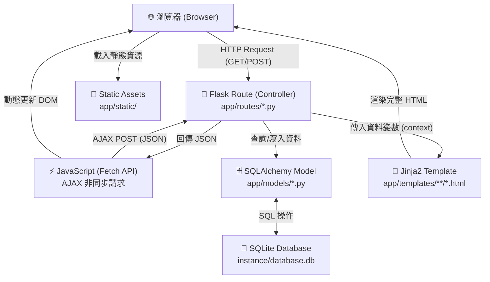
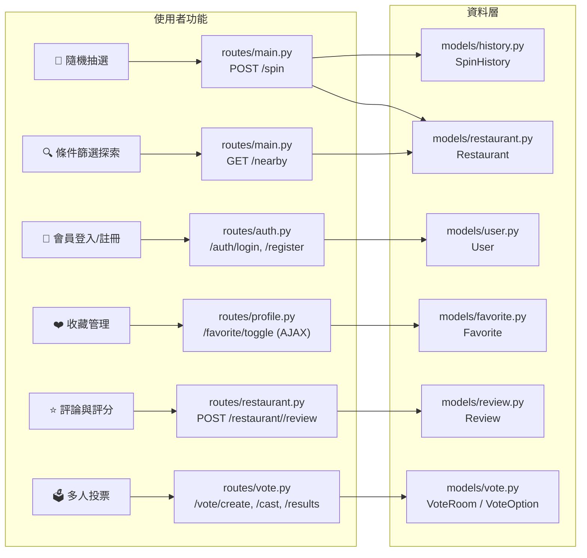

# 隨便吃什麼都好 — 系統架構文件 (ARCHITECTURE.md)

> 本文件依據 `docs/PRD.md` 的功能需求，說明「隨便吃什麼都好」系統的整體技術架構設計，適合初學者閱讀。

---

## 1. 技術架構說明

### 1.1 選用技術與原因

| 層面 | 技術選擇 | 原因 |
|---|---|---|
| **後端框架** | Python + Flask | 課堂統一規範；Flask 輕量、易學，適合小型 Web 應用 |
| **模板引擎** | Jinja2 | Flask 內建整合，負責將後端資料渲染為 HTML 頁面，避免前後端分離的複雜度 |
| **資料庫** | SQLite + Flask-SQLAlchemy | 輕量無需額外安裝伺服器，SQLAlchemy 提供 ORM 介面讓資料操作更簡潔安全 |
| **帳號驗證** | Flask-Login + Flask-Bcrypt | Flask-Login 管理登入 Session；Bcrypt 對密碼進行不可逆 Hash 加密 |
| **前端樣式** | 純 HTML / Vanilla CSS | 無框架依賴，採用 Glassmorphism（玻璃擬態）視覺風格，搭配 Bootstrap Icons CDN |
| **前端互動** | 原生 JavaScript（Fetch API）| 實作 AJAX 非同步請求（收藏切換、轉盤抽選、投票計票輪詢） |

### 1.2 Flask MVC 模式說明

本系統採用 **MVC（Model–View–Controller）** 的三層分工模式：

| 層次 | 對應技術 | 職責說明 |
|---|---|---|
| **Model（模型層）** | `app/models/*.py` + SQLAlchemy | 定義資料庫表格結構（如 `Restaurant`、`User`、`Favorite`），處理所有資料庫讀寫操作 |
| **View（視圖層）** | `app/templates/**/*.html` + Jinja2 | 接收 Controller 傳來的資料，用 Jinja2 語法渲染為最終的 HTML 頁面回傳給瀏覽器 |
| **Controller（控制層）** | `app/routes/*.py` + Flask Blueprint | 接收 HTTP 請求、呼叫 Model 查詢資料、決定回傳 JSON 或渲染哪個 Template |

---

## 2. 專案資料夾結構

```
very-good-1/
│
├── run.py                    # ← 應用程式入口，啟動 Flask 伺服器並執行資料庫 Seed
├── requirements.txt          # ← Python 套件清單
├── schema.sql                # ← 初始 SQL 結構（舊版參考，現以 SQLAlchemy 為主）
├── .gitignore                # ← 排除 __pycache__、instance/ 等不追蹤的檔案
│
├── app/                      # ← 核心應用程式模組目錄
│   ├── __init__.py           # ← 工廠函式 create_app()，初始化 Flask、擴充套件與 Blueprint
│   │
│   ├── models/               # ← Model 層：SQLAlchemy 資料庫模型定義
│   │   ├── __init__.py       # ← 定義並初始化 SQLAlchemy db 實例
│   │   ├── user.py           # ← User 使用者帳號模型
│   │   ├── restaurant.py     # ← Restaurant 餐廳資料模型
│   │   ├── favorite.py       # ← Favorite 會員收藏關聯表
│   │   ├── review.py         # ← Review 餐廳評論與評分
│   │   ├── history.py        # ← SpinHistory 隨機抽選歷史紀錄
│   │   ├── preference.py     # ← UserPreference 個人偏好設定
│   │   └── vote.py           # ← VoteRoom 與 VoteOption 多人投票房間
│   │
│   ├── routes/               # ← Controller 層：Flask Blueprint 路由定義
│   │   ├── __init__.py       # ← 路由套件初始化
│   │   ├── main.py           # ← 首頁(/)、條件抽選(/spin)、附近探索(/nearby)
│   │   ├── auth.py           # ← 會員註冊(/auth/register)、登入/登出(/auth/login)
│   │   ├── restaurant.py     # ← 餐廳詳情(/restaurant/<id>)、提交評論(/review)
│   │   ├── profile.py        # ← 我的收藏(/profile/favorites)、歷史(/profile/history)、收藏切換AJAX(/favorite/toggle)
│   │   └── vote.py           # ← 投票大廳(/vote)、建立房間(/vote/create)、投票(/vote/<id>/cast)、票數查詢(/vote/<id>/results)
│   │
│   ├── templates/            # ← View 層：Jinja2 HTML 模板
│   │   ├── base.html         # ← 基底模板（導覽列、Flash 訊息、頁尾、Toast 容器）
│   │   ├── index.html        # ← 首頁：條件篩選面板 + 輪盤轉動抽選
│   │   ├── auth/
│   │   │   ├── login.html    # ← 登入頁
│   │   │   └── register.html # ← 註冊頁
│   │   ├── restaurant/
│   │   │   └── detail.html   # ← 餐廳詳情：評分、地址、評論列表、留評表單
│   │   ├── main/
│   │   │   └── nearby.html   # ← 附近餐廳探索：進階篩選面板 + 卡片網格
│   │   ├── profile/
│   │   │   ├── favorites.html # ← 我的收藏卡片網格（AJAX 動態移除）
│   │   │   └── history.html  # ← 抽選紀錄與評論歷程雙分頁表格
│   │   └── vote/
│   │       ├── lobby.html    # ← 投票大廳（發起投票）
│   │       └── room.html     # ← 投票房間（即時 Progress Bar 計票）
│   │
│   └── static/               # ← 靜態資源
│       ├── css/
│       │   └── style.css     # ← 主要樣式（Glassmorphism 設計系統）
│       └── js/
│           └── favorite.js   # ← 收藏 AJAX 邏輯 + Toast 通知 + 全域工具函式
│
├── instance/                 # ← 執行時自動生成（不追蹤）
│   └── database.db           # ← SQLite 資料庫檔案
│
└── docs/                     # ← 專案文件
    ├── PRD.md                # ← 產品需求文件
    ├── ARCHITECTURE.md       # ← 本系統架構文件（本文件）
    └── FEATURE_FILTER_DESIGN.md  # ← 條件篩選功能細節設計
```

---

## 3. 元件關係圖

### 3.1 HTTP 請求與回應流程



### 3.2 功能模組對應關係



---

## 4. 關鍵設計決策

### 決策 1：採用 Flask Application Factory 模式

- **做法**：`app/__init__.py` 使用 `create_app()` 工廠函式建立 Flask 實例，而非直接在模組頂層建立。
- **原因**：讓每次呼叫都能建立獨立的 App 實例，方便測試（可注入不同設定），也能避免循環匯入（Circular Import）問題。

### 決策 2：以 SQLAlchemy ORM 取代原始 SQL

- **做法**：全面使用 Flask-SQLAlchemy 定義資料模型，所有資料庫操作透過 `db.session` 完成。
- **原因**：防止 SQL Injection 攻擊（ORM 自動參數化）；讓 Python 開發者用熟悉的物件語法操作資料，降低學習門檻。

### 決策 3：Blueprint 分功能模組化路由

- **做法**：將路由分割為 `main`、`auth`、`restaurant`、`profile`、`vote` 等多個 Blueprint，各自在獨立檔案中定義。
- **原因**：讓專案職責分明、便於多人協作，每位組員可獨立開發自己負責的功能區塊而不干擾彼此。

### 決策 4：AJAX 非同步操作提升互動體驗

- **做法**：收藏切換（`/favorite/toggle`）、轉盤抽選（`/spin`）、投票計票輪詢（`/vote/<id>/results`）均使用 Fetch API 非同步進行，後端回傳 JSON，前端局部更新畫面。
- **原因**：避免每次操作都重新載入整頁，讓使用者體驗更流暢；投票計票採 3 秒輪詢而非 WebSocket，實作簡單且足夠即時。

### 決策 5：多人投票防灌票機制採 Session Cookie

- **做法**：使用者投票後，後端在 `request.cookies` 中記錄「已在此房間投票」的標記；已登入用戶則以 `user_id` 為唯一識別鍵。
- **原因**：投票房間允許未登入的訪客（朋友）參與，無法要求所有人擁有帳號，故採 Cookie 作為最低門檻的防灌票方案。

---

## 5. 資料流摘要

| 功能 | 請求方式 | 資料流程 |
|---|---|---|
| 首頁載入 | `GET /` | Flask → 查詢所有 `category` → 渲染 `index.html` |
| 隨機抽選 | `POST /spin` (JSON) | 接收條件 → 過濾 Restaurant → 隨機抽取 → 寫 SpinHistory → 回傳 JSON |
| 附近餐廳探索 | `GET /nearby` | 接收篩選參數 → 條件查詢 Restaurant → 渲染 `nearby.html` |
| 會員登入 | `POST /auth/login` | 驗證帳號密碼（Bcrypt） → 設定 Flask-Login Session → 重導向 |
| 收藏切換 | `POST /favorite/toggle` (AJAX) | 查詢是否已收藏 → 新增/刪除 Favorite → 回傳 `{status, favorited}` |
| 提交評論 | `POST /restaurant/<id>/review` | 寫入 Review → 重算餐廳平均評分 → 重導向詳情頁 |
| 多人投票 | `POST /vote/<id>/cast` | Cookie 驗證 → 寫入 VoteOption 得票 → 回傳結果 |
