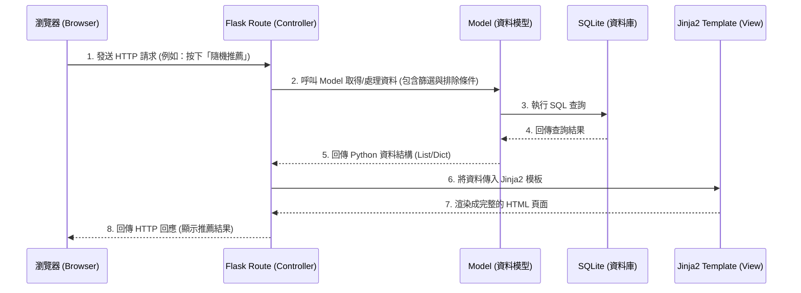

# 隨便吃什麼都好系統 - 系統架構設計 (Architecture)

## 1. 技術架構說明

本專案採用經典的伺服器端渲染（Server-Side Rendering）架構，避免過度複雜的前後端分離設計，以達到快速開發、降低維護成本的目標。

### 選用技術與原因
- **後端框架：Python + Flask**
  - 原因：Flask 是一個輕量級且高彈性的網頁框架，非常適合用來快速開發中小型應用程式與 MVP（最小可行性產品）。
- **模板引擎：Jinja2**
  - 原因：與 Flask 完美整合，能在伺服器端直接將動態資料渲染成 HTML 頁面，減少前端 JavaScript 的依賴。
- **資料庫：SQLite**
  - 原因：無須額外架設資料庫伺服器，檔案型的資料庫容易備份與搬移，非常符合輕量級專案與初期開發的需求。

### Flask MVC 模式說明
本專案採用類似 MVC（Model-View-Controller）的架構模式：
- **Model (資料模型)**：負責與 SQLite 資料庫溝通，定義資料表結構（例如：使用者、餐廳、歷史紀錄等），並處理資料的增刪改查邏輯。
- **View (視圖)**：由 Jinja2 模板與靜態檔案（HTML/CSS/JS）組成，負責將處理好的資料呈現給使用者看。
- **Controller (控制器)**：由 Flask 的 Routes（路由）擔任，負責接收使用者的請求（Request）、呼叫對應的 Model 處理資料，最後將結果傳遞給 View 進行渲染後回傳（Response）。

---

## 2. 專案資料夾結構

以下為本專案的基礎資料夾結構與用途說明：

```text
very-good/
├── app.py                 ← 程式的進入點，負責啟動 Flask 伺服器
├── config.py              ← 存放專案的全域設定（如資料庫路徑、密鑰等）
├── requirements.txt       ← 記錄 Python 的相依套件清單
├── app/                   ← 主要的應用程式邏輯與程式碼
│   ├── __init__.py        ← 初始化 Flask 應用程式實例
│   ├── models/            ← 資料庫模型 (Model)
│   │   ├── __init__.py
│   │   ├── user.py        ← 使用者模型
│   │   ├── restaurant.py  ← 餐廳與口袋名單模型
│   │   └── history.py     ← 歷史紀錄與評價模型
│   ├── routes/            ← 路由控制器 (Controller)
│   │   ├── __init__.py
│   │   ├── main.py        ← 首頁與單人隨機推薦邏輯
│   │   ├── group.py       ← 群組決策模式邏輯
│   │   └── user.py        ← 口袋名單、避雷針與歷史紀錄邏輯
│   ├── templates/         ← HTML 模板 (View)
│   │   ├── base.html      ← 共用的基礎模板（導覽列、頁尾）
│   │   ├── index.html     ← 首頁 / 單人抽籤頁面
│   │   ├── group.html     ← 群組轉盤頁面
│   │   └── profile.html   ← 個人口袋名單與歷史紀錄頁面
│   └── static/            ← 靜態資源檔案
│       ├── css/
│       │   └── style.css  ← 網站樣式表
│       ├── js/
│       │   └── main.js    ← 轉盤動畫等前端互動邏輯
│       └── images/        ← 圖片等素材
└── instance/              ← 存放特定環境的檔案，不進入版控
    └── database.db        ← SQLite 實體資料庫檔案
```

---

## 3. 元件關係圖

以下展示使用者操作時，系統內各元件的互動流程。



---

## 4. 關鍵設計決策

1. **單一資料庫檔案 (SQLite)**
   - **原因**：考量到初期資料量不大且以快速驗證 MVP 為主，使用 SQLite 可免去複雜的資料庫部署。未來若需要擴充，也可平滑轉移至 PostgreSQL 或 MySQL。
2. **採用 Jinja2 伺服器端渲染而非前後端分離 (React/Vue)**
   - **原因**：為了在有限的時間內快速產出成果，避免前後端分離帶來的 API 設計成本與跨域問題。Jinja2 足以處理目前大部分的畫面需求，僅在「轉盤動畫」等特殊效果上使用原生的 Vanilla JavaScript 輔助。
3. **模組化路由 (Blueprints)**
   - **原因**：即便是一個小專案，也將路由拆分為 `main` (單人)、`group` (群組)、`user` (個人) 等模組。這能讓程式碼更好維護，且方便團隊成員分工開發，避免大家都修改同一份 `app.py` 導致衝突。
4. **隨機抽取邏輯在後端處理**
   - **原因**：為了確保資料的一致性與安全性（特別是包含群組模式與黑名單過濾時），所有的篩選與隨機抽取邏輯皆在後端 Flask 執行，前端僅負責觸發與呈現結果。
