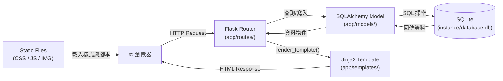
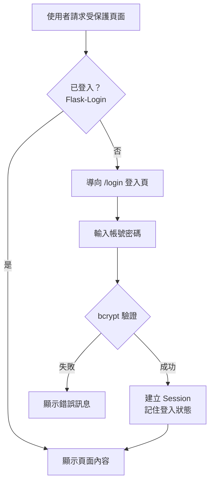
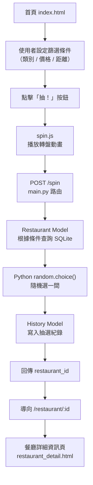

# 系統架構文件（ARCHITECTURE）

**專案名稱：** 隨便吃什麼都好（Let's Just Eat）
**版本：** v1.0
**撰寫日期：** 2026-05-14
**對應 PRD：** docs/PRD.md v1.0

---

## 1. 技術架構說明

### 1.1 選用技術與原因

| 技術 | 版本建議 | 選用原因 |
|---|---|---|
| **Python** | 3.10+ | 主要開發語言，生態豐富、語法簡潔 |
| **Flask** | 3.x | 輕量級 Web 框架，適合中小型專案，學習曲線低 |
| **Jinja2** | 3.x（Flask 內建）| 與 Flask 深度整合的模板引擎，支援模板繼承與區塊複用 |
| **SQLite** | 內建於 Python | 無需額外安裝資料庫伺服器，適合開發與小型部署 |
| **SQLAlchemy** | 2.x | ORM 層，防止 SQL Injection、提升程式碼可讀性 |
| **Flask-Login** | 0.6+ | 管理使用者登入狀態（Session）、保護敏感路由 |
| **Flask-Bcrypt** | 1.x | 密碼雜湊儲存，符合 PRD 安全需求 |
| **HTML5 + CSS3 + JS** | 原生 | 不依賴前端框架，降低複雜度，適合教學專案 |
| **Geolocation API** | 瀏覽器內建 | 取得使用者 GPS 座標，不需額外安裝套件 |

---

### 1.2 Flask MVC 模式說明

本專案採用 **MVC（Model-View-Controller）** 架構，三層各有明確職責：

```
┌──────────────────────────────────────────────────────────┐
│                     MVC 架構職責對照                      │
├─────────────┬──────────────┬────────────────────────────┤
│   層級       │   對應位置   │   職責說明                  │
├─────────────┼──────────────┼────────────────────────────┤
│  Model      │ app/models/  │ 定義資料表結構與資料庫操作   │
│  View       │ app/templates│ Jinja2 HTML 模板，負責畫面  │
│  Controller │ app/routes/  │ Flask 路由，處理請求與邏輯  │
└─────────────┴──────────────┴────────────────────────────┘
```

**運作流程：**
1. 使用者從瀏覽器送出 HTTP Request
2. Flask Router（Controller）接收請求，呼叫對應的 Model 查詢資料
3. Model 透過 SQLAlchemy 操作 SQLite 資料庫，回傳資料
4. Controller 將資料傳入 Jinja2 Template（View）進行渲染
5. 渲染後的 HTML 以 HTTP Response 回傳給瀏覽器

---

## 2. 專案資料夾結構

```
very-good/                         ← 專案根目錄
│
├── app/                           ← 主應用程式套件
│   │
│   ├── __init__.py                ← Flask app 工廠函數（create_app）
│   │
│   ├── models/                    ← Model 層：資料庫結構定義
│   │   ├── __init__.py
│   │   ├── user.py                ← 使用者帳號資料表
│   │   ├── restaurant.py          ← 餐廳資料表
│   │   ├── favorite.py            ← 收藏紀錄資料表
│   │   ├── history.py             ← 抽選歷史紀錄資料表
│   │   └── vote_room.py           ← 多人投票房間資料表（Nice to Have）
│   │
│   ├── routes/                    ← Controller 層：Flask 路由
│   │   ├── __init__.py
│   │   ├── auth.py                ← 帳號相關路由（登入/註冊/登出）
│   │   ├── main.py                ← 首頁、隨機抽選、條件篩選
│   │   ├── restaurant.py          ← 餐廳詳細資訊頁面
│   │   ├── profile.py             ← 使用者個人頁（收藏、歷史）
│   │   └── vote.py                ← 多人投票模式（Nice to Have）
│   │
│   ├── templates/                 ← View 層：Jinja2 HTML 模板
│   │   ├── base.html              ← 共用版型（navbar、footer）
│   │   ├── index.html             ← 首頁（抽選主畫面）
│   │   ├── result.html            ← 抽選結果頁
│   │   ├── restaurant_detail.html ← 餐廳詳細資訊頁
│   │   ├── nearby.html            ← 附近餐廳列表頁
│   │   ├── profile/
│   │   │   ├── favorites.html     ← 我的收藏
│   │   │   └── history.html       ← 抽選歷史
│   │   ├── auth/
│   │   │   ├── login.html         ← 登入頁
│   │   │   └── register.html      ← 註冊頁
│   │   └── vote/
│   │       ├── create.html        ← 建立投票房間
│   │       └── room.html          ← 投票房間頁面
│   │
│   └── static/                    ← 靜態資源
│       ├── css/
│       │   └── style.css          ← 全站共用樣式
│       ├── js/
│       │   ├── spin.js            ← 隨機抽選動畫效果
│       │   ├── geolocation.js     ← GPS 定位功能
│       │   └── vote.js            ← 投票即時更新邏輯
│       └── img/
│           └── default_restaurant.png  ← 預設餐廳封面圖
│
├── instance/                      ← Flask instance 資料夾（不進 git）
│   └── database.db                ← SQLite 資料庫檔案
│
├── docs/                          ← 專案文件
│   ├── PRD.md                     ← 產品需求文件
│   ├── ARCHITECTURE.md            ← 本系統架構文件
│   ├── FLOWCHART.md               ← 使用者流程圖（待產出）
│   └── DB_SCHEMA.md               ← 資料庫設計文件（待產出）
│
├── .agents/                       ← AI Agent Skill 資料夾
│   └── skills/
│
├── .gitignore                     ← 忽略 instance/、__pycache__/ 等
├── requirements.txt               ← Python 套件清單
├── config.py                      ← 應用程式設定（SECRET_KEY 等）
└── app.py                         ← 應用程式進入點（run server）
```

---

## 3. 元件關係圖

### 3.1 整體請求流程



---

### 3.2 使用者帳號驗證流程



---

### 3.3 隨機抽選核心流程



---

## 4. 關鍵設計決策

### 決策一：使用 Flask App Factory 模式

**做法：** 在 `app/__init__.py` 中定義 `create_app()` 工廠函數，而非直接在模組層級建立 Flask 實例。

**原因：**
- 避免循環引用（circular import）問題
- 方便在未來切換不同設定（開發 / 測試 / 正式環境）
- 符合 Flask 官方最佳實踐

```python
# app/__init__.py
def create_app():
    app = Flask(__name__)
    app.config.from_object('config.Config')
    db.init_app(app)
    # 註冊 Blueprint...
    return app
```

---

### 決策二：路由使用 Blueprint 分模組管理

**做法：** 將路由依功能拆成多個 Blueprint（`auth`、`main`、`restaurant`、`profile`、`vote`），各自在獨立檔案中定義。

**原因：**
- 避免單一 `routes.py` 過於龐大（預計超過 300 行）
- 每位組員可以各自負責一個 Blueprint，減少 Git 衝突
- 路由前綴（URL prefix）清楚分隔各功能區塊

```python
# 範例：auth Blueprint 前綴 /auth
# /auth/login, /auth/register, /auth/logout
```

---

### 決策三：模板繼承減少重複 HTML

**做法：** 建立 `base.html` 作為共用版型，其他頁面透過 `` 繼承，只覆寫 `` 區塊。

**原因：**
- Navbar、Footer、CSS/JS 引用只需寫一次
- 更改全站外觀只需修改 `base.html`
- 讓負責前端的組員能快速上手

---

### 決策四：GPS 定位在前端處理，座標傳送到後端

**做法：** 使用瀏覽器 `Geolocation API`（`geolocation.js`）取得使用者緯經度，透過 AJAX 或表單 POST 傳送給 Flask，後端再計算距離並篩選餐廳。

**原因：**
- 後端無法直接取得使用者 GPS 座標
- 前端取得後以 `latitude` / `longitude` 參數傳入路由
- 距離計算使用 Haversine 公式（Python 實作），不依賴外部 API

---

### 決策五：多人投票模式使用 Session-Based 簡單實作（非 WebSocket）

**做法：** 投票房間狀態存於 SQLite，前端使用 JavaScript `setInterval` 定期輪詢（polling）`/vote/room/<code>/status`，而非使用 WebSocket 即時推送。

**原因：**
- WebSocket 需要額外安裝 `Flask-SocketIO`，增加複雜度
- 投票場景不需要毫秒級即時性，3–5 秒輪詢即可接受
- 降低初學者學習成本，先以 MVP 方式實現
- 未來可升級為 WebSocket 而不影響資料庫設計

---

## 附錄：套件清單（requirements.txt 參考）

```
Flask==3.0.0
Flask-SQLAlchemy==3.1.1
Flask-Login==0.6.3
Flask-Bcrypt==1.0.1
Jinja2==3.1.2
SQLAlchemy==2.0.0
```
