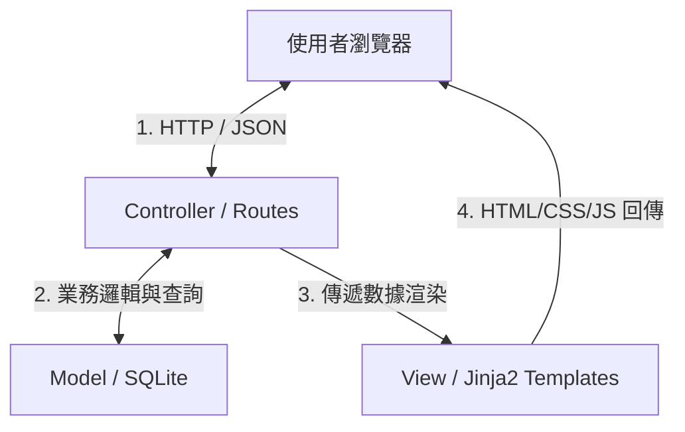
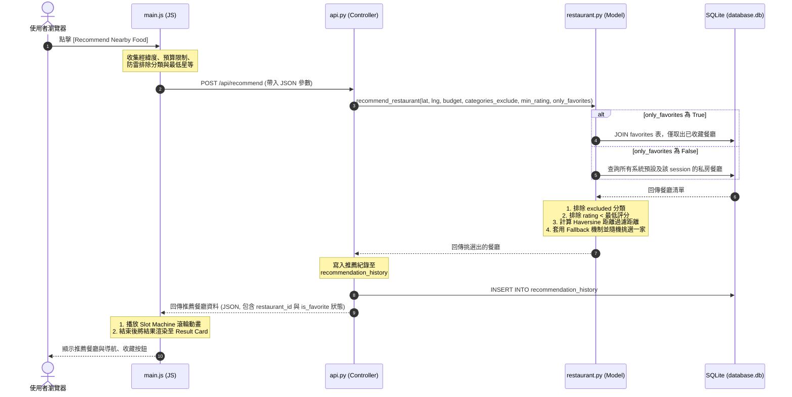
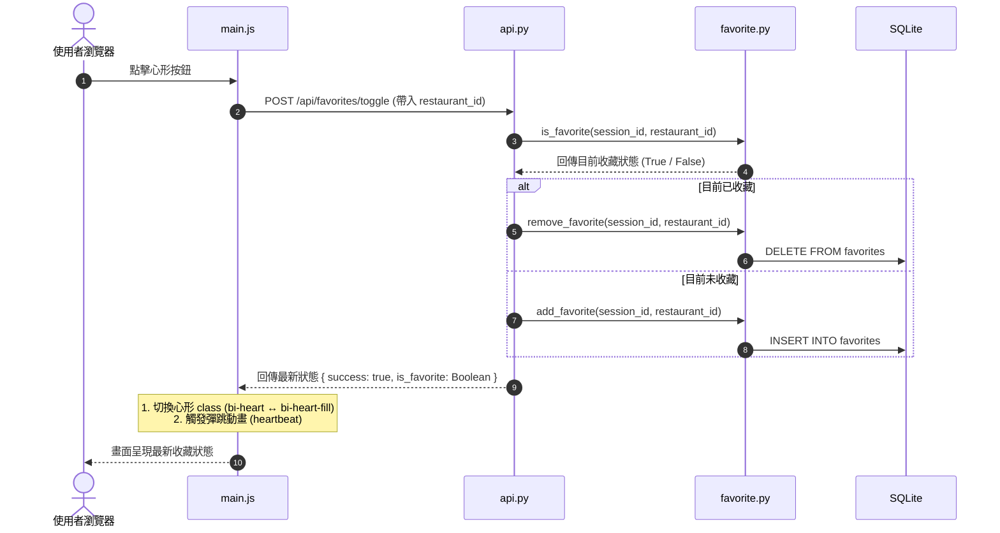

# 隨便吃什麼都好系統 - 系統架構設計文件 (ARCHITECTURE.md)

本文件根據產品需求文件 (PRD) 與當前系統實作，詳細規劃「隨便吃什麼都好」系統的技術選型、Flask MVC 架構模式、專案資料夾結構、元件關係圖以及關鍵的設計決策，提供開發人員與維護人員清晰的技術藍圖。

---

## 1. 技術架構說明

本系統採用輕量、快速且易於擴充的架構，專門為減少使用者的「決策成本」而設計。系統在後端採用經典的 **MVC (Model-View-Controller)** 設計模式，配合前端的非同步非阻塞請求 (AJAX)，在保持傳統伺服器渲染穩定性的同時，提供了媲美單頁應用 (SPA) 的流暢互動體驗。

### 選用技術與原因

| 技術層面 | 選用技術 | 選用原因與優勢 |
| --- | --- | --- |
| **後端核心** | **Python + Flask** | 輕量型微框架 (Micro-framework)，啟動極速、語法簡潔，且擁有豐富的 Python 生態圈，非常適合中小型專題與快速原型開發。 |
| **網頁渲染 (View)** | **Jinja2 模板引擎** | Flask 內建的強大模板引擎。能安全、流暢地進行伺服器端網頁渲染，避免前端渲染 (SSR) 的複雜配置，並防止常見的 XSS 漏洞。 |
| **輕量資料庫** | **SQLite 3** | 無伺服器 (Serverless) 的輕量級檔案資料庫。無需繁瑣的資料庫安裝與埠號設定，資料庫即為一個檔案，移轉性極佳，且非常適合此規模的專案。 |
| **前端樣式** | **Bootstrap 5 + Vanilla CSS** | 採用 HSL 調和配色與 Glassmorphism (毛玻璃) 現代視覺樣式。結合 Bootstrap 5 的響應式網頁設計 (RWD) 格線，確保在行動端與電腦端皆有極佳視覺與操控感。 |
| **地圖與定位** | **HTML5 Geolocation** | 透過瀏覽器直接獲取用戶的高精確度 GPS 經緯度，無需使用者手動輸入，降低決策的輸入成本。 |

### Flask MVC 模式說明

系統嚴格遵循 Flask 的 MVC 設計規範，明確劃分各個模組的職責，以維持代碼的乾淨與可讀性：



1. **Model (模型 - 負責數據與業務邏輯)**:
   - 位於 `app/models/` 目錄中。
   - 負責與 SQLite 資料庫進行直接互動，定義數據的存取與操作邏輯。
   - **代表元件**：
     - `database.py`: 管理資料庫連接 (`get_db_connection`)。
     - `restaurant.py`: 負責餐廳數據讀取、私房餐廳新增、以及**核心隨機推薦演算法**。
     - `favorite.py`: 管理口袋名單（收藏與取消收藏）邏輯。
     - `history.py`: 管理推薦歷史紀錄與使用者真實心得評論的讀寫。

2. **View (視圖 - 負責畫面呈現)**:
   - 位於 `app/templates/` 與 `app/static/` 中。
   - 負責將後端傳來的數據轉化成網頁畫面，並處理客戶端的多樣微動畫與介面切換。
   - **代表元件**：
     - `base.html` & `index.html`: Jinja2 模板，定義了 App 的毛玻璃外觀與 Tabs 架構。
     - `style.css`: 實作 Glow 發光、`heartbeat` 動畫與卡片漸變特效。
     - `main.js`: 處理前端路由(Tabs切換)、GPS定位、Slot Machine (滾輪動畫)及與後端 API 的非同步溝通 (Fetch API)。

3. **Controller (控制器 - 負責路由與協調)**:
   - 位於 `app/routes/` 目錄中。
   - 負責接收瀏覽器傳來的 HTTP 請求，調用對應的 Model 處理數據，最後決定渲染哪一個 View，或回傳 JSON 格式數據。
   - **代表元件**：
     - `main.py`: 負責主頁面渲染（傳統頁面路由）。
     - `api.py`: 處理 API 請求（抽籤推薦、收藏切換、評論保存、私房菜新增），回傳標準 JSON 格式。

---

## 2. 專案資料夾結構

專案採用結構化的 Flask Blueprint 模式進行模組化組織，以下為專案的完整樹狀結構：

```
very-good-1/
├── app/                        # 系統核心應用程式目錄
│   ├── __init__.py             # Flask App 工廠模式 (Factory) 初始化與 Blueprint 註冊
│   ├── models/                 # Model 層：業務邏輯與資料庫互動
│   │   ├── __init__.py
│   │   ├── database.py         # 連線管理與初始化結構 (SQLite get_db_connection)
│   │   ├── favorite.py         # 口袋名單收藏模型 (新增、刪除、列表)
│   │   ├── history.py          # 推薦歷史與評論心得模型 (評分、評語、歷史 CRUD)
│   │   └── restaurant.py       # 餐廳查詢與距離計算、多條件推薦核心算法 (Haversine)
│   ├── routes/                 # Controller 層：路由定義與 API 介面
│   │   ├── __init__.py
│   │   ├── api.py              # 提供前端 Fetch 使用的 RESTful APIs (進階抽籤、評論、收藏等)
│   │   └── main.py             # 負責主網頁 index.html 的進入路由
│   ├── static/                 # 靜態資源目錄
│   │   ├── css/
│   │   │   └── style.css       # 系統視覺樣式表 (含毛玻璃 Glassmorphism、心形與星星微動畫)
│   │   └── js/
│   │       └── main.js         # 前端操控器 (定位、分頁切換、滾輪滾動動畫、非同步 API 串接)
│   └── templates/              # View 層：HTML 介面模板
│       ├── base.html           # 全域主版面 (載入 Bootstrap, Google Fonts 與基本架構)
│       └── index.html          # 主頁面 (包含探索、口袋名單、探險日誌三個 Tabs 與進階篩選區)
├── database/                   # 資料庫初始化與輔助腳本
│   ├── schema.sql              # SQLite 資料表綱要 (DDL)
│   └── seed.py                 # 資料庫填充腳本 (包含預設的台北與台中餐廳範例數據)
├── docs/                       # 文件目錄
│   ├── ARCHITECTURE.md         # 系統架構設計文件 (本文件)
│   ├── PRD.md                  # 產品需求文件
│   └── FEATURE_LOCATION_RECOMMEND.md  # 附近推薦功能分析
├── instance/                   # 執行期實例目錄
│   └── database.db             # 實際運作的 SQLite 資料庫檔案 (由 gitignore 忽略)
├── .env.example                # 環境變數設定範本 (SECRET_KEY 等)
├── .gitignore                  # Git 忽略清單 (忽略 .venv, *.db, pycache 等)
├── requirements.txt            # 專案 Python 依賴套件清單 (Flask, python-dotenv)
└── run.py                      # 系統啟動入口檔案 (執行 python run.py 即可啟動開發伺服器)
```

---

## 3. 元件關係圖

以下展示系統在不同情境下的**資料流向與元件交互關係**：

### A. 進階隨機推薦流程 (非同步 API)
此流程展示了使用者在前端點擊「推薦」按鈕，並加入防雷限制時，後端如何協調 Model 完成計算：



### B. 收藏與取消收藏流程 (即時同步)
使用者點擊心形按鈕時的非同步收藏交互關係：



---

## 4. 關鍵設計決策

為了確保本系統能夠「終結選擇困難」，我們在技術架構上做了以下關鍵決策：

### 決策 1：採用單網頁 (SPA-like) 搭配底部的「分頁 Tabs」架構
- **做法**：捨棄傳統多個網頁跳轉的設計，將「探索」、「口袋名單」與「探險日誌」整合在單一網頁 (`index.html`)，透過前端 JS 來切換顯示的 DOM 容器，並利用底部毛玻璃導覽列控制。
- **原因**：傳統網頁切換時，瀏覽器會重新整理，造成畫面閃爍並中斷使用者的注意力（尤其在行動裝置上）。採用 Tabs 架構，能提供接近 Native App 的流暢體驗；同時因為後端仍為單一主要路由渲染，避免了配置繁瑣的前端路由 (Vue/React Router)，保持了開發的極簡性。

### 決策 2：基於 Session Cookie 的「無感登入」與數據隔離
- **做法**：不在資料庫建立包含密碼與信箱的 `users` 帳號表。改為當使用者進入首頁時，後端自動檢查 Flask `session`。若無 `session_id` 則自動生成一個唯一的 UUID，並以此 UUID 作為使用者識別碼，保存在資料庫各表的 `session_id` 欄位中。
- **原因**：決策成本包含「使用平台的成本」。「要先註冊帳號才能抽餐廳」會直接勸退想快速做決定的使用者。透過 Session-based 機制，使用者完全不需要註冊與登入即可立即使用「收藏」、「評論」與「私房菜」功能，做到了極低的使用門檻；同時也能確保在同一台手機/瀏覽器上，使用者擁有的隱私與數據隔離。

### 決策 3：內存篩選與 Fallback (退路) 推薦機制
- **做法**：推薦算法中，不使用複雜的 SQL 語法在資料庫端進行多層次過濾。而是直接由 Model 取出符合條件的基本餐廳集合，在 Python 記憶體中利用迴圈、Set 快速做排除（預算、避雷標籤、評分），再進行 Haversine 距離計算。若距離篩選結果為空，自動觸發 Fallback（退回沒有距離限制的條件清單中隨機抽取）。
- **原因**：
  1. 保持 SQL 語法的簡單性，減少 SQLite 的負擔。
  2. Haversine 距離計算涉及三角函數，直接用 Python 計算效能極佳。
  3. **極其重要**：避免出現「沒有符合條件的餐廳」這種決策死胡同。當設定太嚴格（如距離 1km、高評分、低預算）導致無結果時，Fallback 機制保證一定能給出一家餐廳，避免系統停擺。

### 決策 4：自訂口袋餐廳與全域資料庫的巧妙整合
- **做法**：使用者可以點擊「新增私房菜」來擴充名單。私房菜並非寫在特殊的「個人表」中，而是直接 INSERT 到主 `restaurants` 表中，但將其 `is_custom` 設為 1，並綁定當前的 `session_id`。
- **原因**：如此一來，原有的隨機推薦演算法 (`recommend_restaurant`) 完全不需要修改核心篩選邏輯，就能將「系統預設餐廳」與「用戶自訂私房餐廳」完美融合成一個列表進行隨機抽取。這極大簡化了程式碼，且私房菜新增後自動加入收藏（`favorites`），實現了最直覺的業務邏輯。
