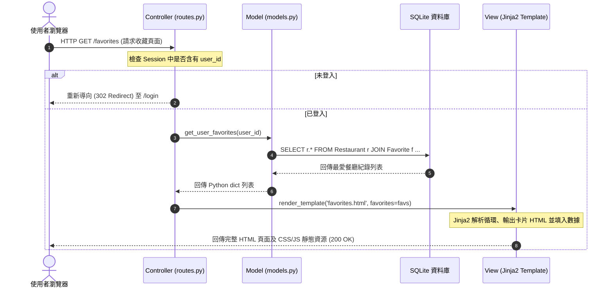
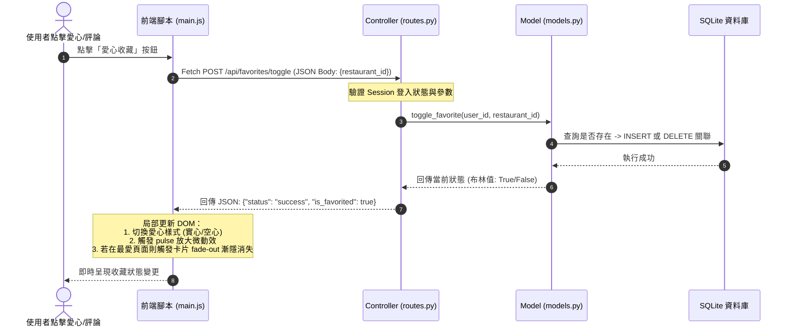

# 系統架構設計說明書 (ARCHITECTURE.md)

本文件根據 [產品需求文件 (PRD.md)](file:///c:/Users/AmyLin/OneDrive/桌面/very-good-1/docs/PRD.md) 的規格與核心功能，詳細規劃與紀錄「隨機推薦系統 - 隨便吃什麼都好」的技術架構、資料夾結構、元件交互關係，以及關鍵設計決策，以便開發團隊與初學者能快速理解系統全貌。

---

## 1. 技術架構說明 (Technology Stack)

本專案採用輕量、高效且結構清晰的單體架構 (Monolithic Architecture)，頁面渲染由後端 Flask 與 Jinja2 引擎協同完成，免去複雜的前後端分離部署，同時在前端輔以 Vanilla JS 與 Fetch API 實現流暢的無刷新 AJAX 互動。

### 選用技術與原因

| 層面 | 選用技術 | 選用原因與優勢 |
| :--- | :--- | :--- |
| **後端** | **Python 3.x + Flask** | 輕量且靈活的微型框架，能快速建立 API 與頁面路由，適合敏捷開發與中小型專題。 |
| **模板引擎** | **Jinja2** | Flask 內建的強大模板引擎，支持繼承、邏輯判斷與變數綁定，能完美達成動態伺服器端渲染 (SSR)。 |
| **資料庫** | **SQLite (sqlite3)** | 輕量級關聯式資料庫，資料直接儲存於單一檔案 (`database.db`)，無需安裝與配置複雜的資料庫伺服器，且與 Python 高度整合。 |
| **前端樣式** | **Bootstrap 5 + Vanilla CSS** | Bootstrap 5 負責建立響應式佈局 (RWD) 與基礎 UI 元件；自訂 CSS 則用於實現極致美感的毛玻璃效果 (Glassmorphism) 與流暢動效。 |
| **前端互動** | **Vanilla JS (Fetch API)** | 無需載入龐大的 JS 框架（如 React/Vue），即可快速實現與後端 API 的非同步通訊（如：愛心收藏切換、無刷新評論提交與刪除）。 |

---

### Flask MVC 模式說明

本專案遵循經典的 **MVC (Model-View-Controller)** 設計模式，確保代碼的高內聚與低耦合：

```
                    ┌─────────────────────────┐
                    │      Browser (用戶)     │
                    └────────┬────────▲────────┘
            1. HTTP Request  │        │  4. HTML Render (Jinja2)
            (or AJAX Fetch)  │        │  (or JSON Response)
                             ▼        │
                  ┌───────────────────┴─────────┐
                  │    Controller (routes.py)   │ ◄───┐
                  └────────┬──────────▲─────────┘     │
            2. Call Query  │          │ 3. Return     │ (Template Binding)
                           ▼          │    Data       │
                  ┌───────────────────┴─────────┐     │
                  │      Model (models.py)      │     │
                  └────────┬──────────▲─────────┘     │
            SQL Query      │          │ Fetch Rows    │
                           ▼          │               │
                  ┌───────────────────┴─────────┐     │
                  │      Database (SQLite)      │     │
                  └─────────────────────────────┘     │
                                                      │
                  ┌───────────────────────────────────┘
                  │      View (templates/)
```

* **Model (模型 - `app/models.py`)**：
  - **職責**：負責資料庫的初始化 (`init_db`)、資料結構表 (Schemas) 的定義，以及所有直接對資料庫進行的 CRUD（增刪改查）操作。
  - **內容**：包含會員管理（註冊、密碼雜湊加密、密碼驗證）、最愛收藏管理、評論管理、以及最核心的「動態 SQL 多重篩選隨機隨機推薦演算法」。
* **View (視圖 - `app/templates/`)**：
  - **職責**：負責呈現使用者介面 (UI) 與數據視覺化，透過 Jinja2 語法動態將後端傳來的數據填入 HTML 中。
  - **內容**：首頁 (`index.html`)、收藏夾 (`favorites.html`)、評論紀錄時間軸 (`reviews.html`)，以及基礎模板 (`base.html`)。
* **Controller (控制器 - `app/routes.py`)**：
  - **職責**：作為 Model 與 View 之間的橋樑。負責接收使用者的請求 (HTTP 請求或 AJAX API 呼叫)，調用對應的 Model 函數處理數據，並決定渲染哪個 View 頁面，或是回傳 JSON 格式的 API 結果。
  - **內容**：帳號認證路由、網頁渲染路由、動態抽籤 API、AJAX 收藏與評論 API。

---

## 2. 專案資料夾結構 (Project Structure)

專案結構嚴格遵循 Flask 最佳實踐，保持模組化與高可讀性：

```text
very-good-1/
├── app/                        # 應用程式主模組 (Application Package)
│   ├── models.py               # 【Model】定義資料庫 Schema、CRUD 操作與密碼 Hash 安全驗證
│   ├── routes.py               # 【Controller】定義 Flask 路由、Session 登入狀態控制與 API 端點
│   ├── static/                 # 靜態資源目錄
│   │   ├── css/
│   │   │   └── style.css       # 全域樣式表：包含毛玻璃效果、愛心脈衝動效、評分星星懸停等
│   │   └── js/
│   │       └── main.js         # 前端 JavaScript：串接 API、AJAX 動態非同步請求控制與 DOM 局部更新
│   └── templates/              # 【View】Jinja2 HTML 模板
│       ├── base.html           # 基礎共享模板：包含毛玻璃 RWD 導航欄、Flash 提示與公共資源載入
│       ├── index.html          # 首頁：包含隨機抽取結果卡片、進階篩選摺疊面板、評論寫入與列表
│       ├── favorites.html      # 我的最愛頁面：展示收藏卡片網格與專屬「最愛抽一家」金色抽取系統
│       ├── reviews.html        # 評論歷史頁面：以毛玻璃時間軸 (Timeline) 與卡片呈現歷史紀錄
│       ├── login.html          # 登入頁面：極簡高質感毛玻璃登入卡片
│       └── register.html       # 註冊頁面：包含前端即時安全強度提示的註冊卡片
├── database/                   # 資料庫備份與初始化腳本目錄
├── docs/                       # 專案文檔目錄
│   ├── PRD.md                  # 產品需求文件
│   ├── Restaurant_Info_Design.md # 餐廳顯示流程與資料表設計
│   └── ARCHITECTURE.md         # 【本文件】系統架構說明書
├── instance/                   # 運行時實例目錄（Git 忽略）
│   └── database.db             # 生產與本機開發使用的 SQLite 資料庫檔案
├── app.py                      # 系統入口檔案：配置 Flask App、註冊 Blueprint 並運行
├── requirements.txt            # Python 依賴包列表 (包含 Flask, Werkzeug 等)
└── .gitignore                  # Git 忽略設定檔案 (忽略 __pycache__、instance/*.db 等)
```

---

## 3. 元件關係圖 (Component Interaction Diagrams)

### 3.1 傳統網頁載入流程 (以登入 / 查看最愛為例)
使用者在瀏覽器點擊連結時，會觸發後端的 Controller 進行查詢，接著將結果餵給 Jinja2 模板，渲染出完整的 HTML 網頁並回傳給瀏覽器。



---

### 3.2 局部非同步無刷新流程 (以 AJAX 收藏 / 評論為例)
為提升使用者體驗，我們採用非同步互動。使用者點擊「愛心」或「發表評論」時，網頁不會重新整理，而是由 `main.js` 發送 Fetch API，後端回傳 JSON 數據後，由前端直接使用 JS 動態操作 DOM 更新介面。



---

## 4. 關鍵設計決策 (Key Design Decisions)

在架構設計過程中，我們做出了以下幾個關鍵選擇，以符合易用性、高性能與優雅代碼結構的目標：

### 決策 1：使用單體 Flask 搭配 Jinja2，而非前後端分離（如 React/Vue）
* **背景與原因**：PRD 要求快速、極簡且課堂易讀性高。前後端分離需要維護兩個獨立專案、處理跨網域 (CORS) 議題，部署成本高。
* **解決方案**：採用單體架構，讓 Flask 內建的 Jinja2 模板直接處理大架構渲染，維持極高的開發速度。
* **效果**：初學者極易上手，專案僅需一個 `python app.py` 即可完成前端與後端的同步運行，極致簡化部署。

### 決策 2：混合式渲染模式 (Hybrid Rendering Pattern)
* **背景與原因**：純後端渲染在每一次使用者互動時（如點擊愛心、寫評論）都需要刷新整頁，會破壞「決策平台」那種流暢、直覺的卡片互動感；然而純 SPA (單頁應用) 又會使代碼過於臃腫。
* **解決方案**：**「大頁面後端渲染，小互動 AJAX 局部更新」**。導航欄、頁面架構與帳號表單使用 Jinja2 直出；而最愛按鈕、抽籤轉動、評論送出與刪除則全部寫成 API，前端用 `Fetch API` 發送非同步請求。
* **效果**：既保留了頁面切換的 SEO 與首屏加載優勢，又實現了點擊愛心時卡片淡出、點擊星星時無刷新送出評論的 Premium 質感。

### 決策 3：基於安全 Hash 驗證的 SQLite 輕量化密碼儲存
* **背景與原因**：為確保系統安全性，絕不能以明文儲存用戶密碼。
* **解決方案**：採用 Flask 內建的安全模組 `werkzeug.security` 的 `generate_password_hash`（使用預設的 PBKDF2 含 Salt 加密演算法）與 `check_password_hash`。
* **效果**：即使資料庫檔案 (`database.db`) 意外外流，攻擊者也極難破解密碼雜湊值，以最輕量的方式保證了 PRD 對於基本用戶隱私與安全性的要求。

### 決策 4：無 ORM 的原生參數化 SQL 查詢
* **背景與原因**：引入複雜的 ORM（如 SQLAlchemy）會增加資料庫的抽象層，對於初學者理解底層 SQL 運作與客製化「多重動階篩選條件」造成困難。
* **解決方案**：直接使用 Python 內建的 `sqlite3`，並使用 `sqlite3.Row` 以字典方式操作資料。在 `get_random_restaurant` 中，採用動態字串拼接的參數化查詢（`?` 預留位置）。
* **效果**：
  - 避免了 SQL 注入攻擊 (SQL Injection)，保證資料庫安全性。
  - 保留了最直觀、清晰的 SQL 語法，便於對 SQL 做效能調優，同時大幅降低了框架學習難度。
  - 可輕鬆根據前端傳來的 `category`、`price_level` 與 `min_rating` 動態組裝多欄位篩選條件。

---

## 5. 架構擴充指南 (Future Scalability)

本系統的架構具備良好的模組化設計，未來若需進行功能擴展，可遵循以下指引：

1. **若要串接 Google Places API**：
   - 可在 `app/models.py` 中新增一個 `fetch_and_cache_places(lat, lng)` 函數。
   - 當本地資料庫符合篩選的餐廳少於一定數量時，透過 `requests` 套件呼叫 Google Places API，並將取得的資料批量寫入 `Restaurant` 資料表，直接做快取。
2. **若要實作「黑名單 (Blacklist)」功能**：
   - 可以在資料庫中新增一張 `Blacklist` 表，結構與 `Favorite` 類似（包含 `user_id` 與 `restaurant_id`）。
   - 在 `get_random_restaurant` 函數的動態 SQL 查詢中，加入額外過濾子句：`AND id NOT IN (SELECT restaurant_id FROM Blacklist WHERE user_id = ?)`。
3. **若要升級為 SQLAlchemy (ORM)**：
   - 可以在 `app/` 底下新增 `models/` 資料夾，將 `User`、`Restaurant`、`Favorite`、`Review` 改寫為定義類別 (Models Class)，並透過 `Flask-SQLAlchemy` 插件進行資料庫連線管理，能更方便地對應複雜的物件關係。
