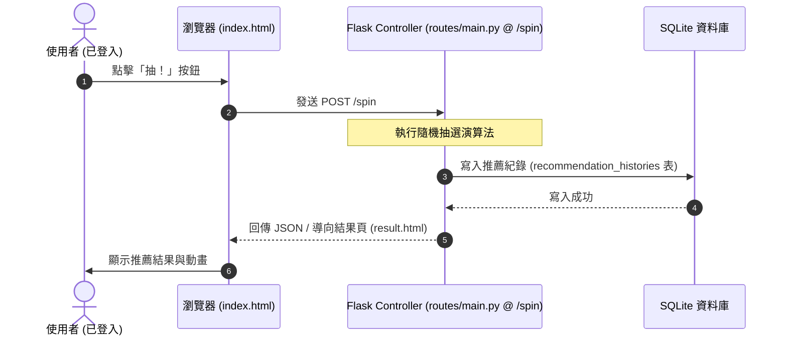
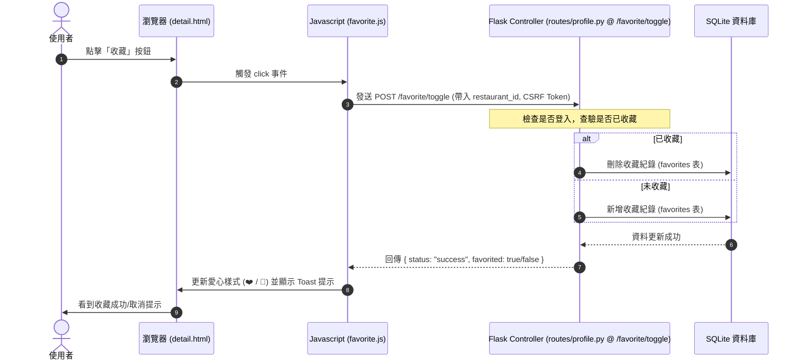
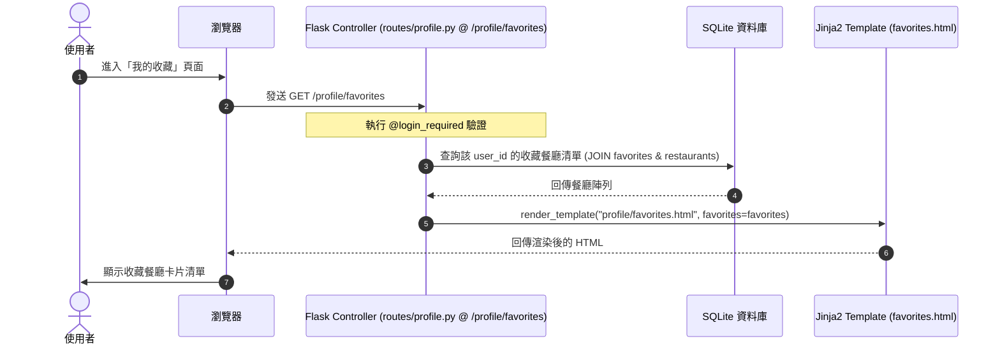

# 系統架構文件（Feature Architecture）- F-05 收藏與歷史紀錄

**專案名稱：** 隨便吃什麼都好（Let's Just Eat）  
**功能模組：** F-05 收藏與歷史紀錄 (Favorites & Recommendation History)  
**對應主架構：** [docs/ARCHITECTURE.md](file:///c:/Users/USER/very-good/docs/ARCHITECTURE.md)  
**對應 PRD：** [docs/PRD_F05.md](file:///c:/Users/USER/very-good/docs/PRD_F05.md)  
**狀態：** 草稿  
**撰寫日期：** 2026-05-20  

---

## 1. 技術架構說明
本功能基於 Flask 的 MVC（Model-View-Controller）模式進行設計，確保職責分離。以下為 F-05 模組在各層級的具體職責：

### 1.1 MVC 各層設計
* **Model（模型層）**：
  - `Favorite`：對應 SQLite 資料表 `favorites`，定義使用者 ID 與餐廳 ID 的多對多收藏關聯。
  - `RecommendationHistory`：對應 SQLite 資料表 `recommendation_histories`，儲存每次推薦的餐廳、被推薦的使用者以及推薦發生的時間戳記。
* **View（視圖層 - HTML/Jinja2 & CSS/JS）**：
  - `profile/favorites.html`：顯示使用者的收藏清單卡片。
  - `profile/history.html`：顯示使用者的推薦歷史紀錄表格。
  - 前端 AJAX 腳本（`static/js/favorite.js`）：負責非同步處理收藏與取消收藏按鈕的點擊事件，發送 Fetch API 請求並即時更新 UI。
* **Controller（控制器層 - Flask Routes）**：
  - `profile.py` 路由：處理 `/profile/favorites` 與 `/profile/history` 頁面請求，從 Model 查詢目前登入用戶的資料並傳給 Jinja2 渲染。
  - `main.py` 路由：在 `/spin`（進行隨機推薦）中，成功推薦餐廳後，自動在背景呼叫 `RecommendationHistory` 寫入歷史紀錄。
  - AJAX API 路由（例如 `/favorite/toggle`）：提供非同步點擊的端點，回傳 JSON 結果。

---

## 2. 專案資料夾結構（F-05 關聯檔案）
以下樹狀圖標記了 F-05 收藏與歷史紀錄功能涉及的所有關鍵檔案及其職責：

```
very-good/
├── app/
│   ├── models/
│   │   ├── favorite.py        ← 定義 Favorite Model（SQLite 收藏資料表）
│   │   └── history.py         ← 定義 RecommendationHistory Model（SQLite 歷史紀錄資料表）
│   │
│   ├── routes/
│   │   ├── main.py            ← 隨機抽選路由，在此觸發寫入歷史紀錄
│   │   └── profile.py         ← 個人中心路由，包含查看收藏、查看歷史紀錄、AJAX 收藏 API
│   │
│   ├── templates/
│   │   ├── restaurant_detail.html ← 餐廳詳情頁，包含收藏愛心按鈕
│   │   └── profile/
│   │       ├── favorites.html ← 我的收藏頁面（Bootstrap 5 卡片）
│   │       └── history.html   ← 抽選歷史頁面（Bootstrap 5 表格）
│   │
│   └── static/
│       └── js/
│           └── favorite.js    ← 負責 AJAX 發送 /favorite/toggle 請求的 JavaScript 腳本
│
├── instance/
│   └── database.db            ← 儲存資料的 SQLite 檔案
└── app.py                     ← 專案進入點
```

---

## 3. 元件關係與資料流圖
F-05 功能包含三個核心資料流：

### 3.1 隨機抽選時自動記錄歷史 (Write Flow)
當使用者登入並點擊抽選時，系統在完成抽選後，會同步將推薦紀錄寫入 SQLite：



### 3.2 收藏/取消收藏 (AJAX Toggle Flow)
使用者在餐廳詳細頁面點擊收藏時，前端 JS 使用 Fetch API 發送非同步請求，避免整頁重新整理：



### 3.3 載入收藏與歷史紀錄 (Read Flow)
使用者進入個人中心查看收藏或歷史紀錄：



---

## 4. 關鍵設計決策

### 4.1 決策一：AJAX 非同步收藏切換
* **做法**：不使用傳統的 `<form>` 表單提交整頁重新整理，而是使用 JavaScript `Fetch API` 送出 `POST` 請求到 `/favorite/toggle`。
* **原因**：使用者在看餐廳詳情或抽選結果時，若點擊收藏會導致整頁重新載入，將嚴重打斷操作流暢度。AJAX 可以實現 150ms 內無痛狀態轉換，並搭配 Bootstrap Toast 提供即時反饋，是優化 UX 的關鍵。

### 4.2 決策二：利用 SQL JOIN 與 SQLAlchemy 關係關聯
* **做法**：歷史紀錄表（`recommendation_histories`）僅儲存 `user_id`、`restaurant_id` 與 `recommended_at`，不儲存餐廳名稱、類型、評分等資訊。查詢時透過 SQLAlchemy 的 `relationship` 進行 `JOIN` 查詢。
* **原因**：符合資料庫正規化設計。如果餐廳資料（如評分或類型）未來被管理員修改，歷史紀錄中顯示的餐廳資訊亦能自動保持一致，避免資料冗餘與不一致的問題。

### 4.3 決策三：後端強登入防護 (Flask-Login @login_required)
* **做法**：所有與收藏與歷史紀錄相關的 Controller 路由（例如 `/profile/favorites`、`/profile/history`、`/favorite/toggle`）都必須加上 Flask-Login 的 `@login_required` 裝飾器。
* **原因**：確保使用者資料隔離與安全性。未登入的匿名使用者無法透過修改 URL 或直接呼叫 API 取得或竄改他人的收藏與歷史紀錄，防範水平越權漏洞。

### 4.4 決策四：採用唯一聯合索引防止重複收藏
* **做法**：在 `favorites` 資料表中，對 `(user_id, restaurant_id)` 建立唯一限制條件（Unique Constraint）。
* **原因**：在高併發或網路延遲下，使用者可能連續快速點擊多次收藏按鈕，如果沒有資料庫層級的唯一性限制，可能會在資料庫中插入多筆重複的收藏紀錄。唯一索引可以在最底層保證資料的乾淨性。
