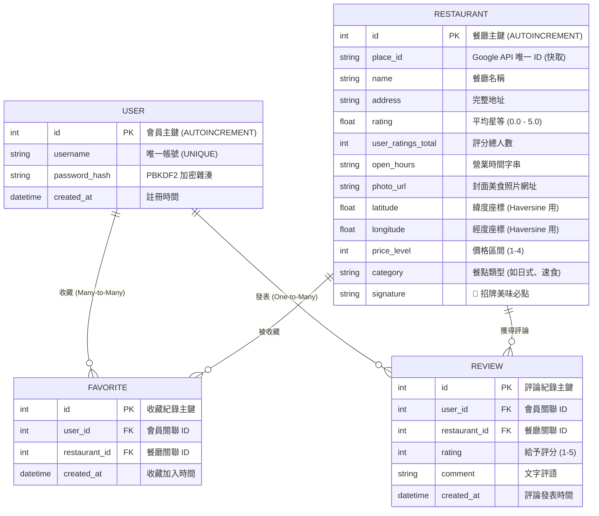

# 系統資料庫設計說明書 (DB_DESIGN.md)

本文件依據 [產品需求文件 (PRD.md)](file:///c:/Users/AmyLin/OneDrive/桌面/very-good-1/docs/PRD.md)、[系統架構設計說明書 (ARCHITECTURE.md)](file:///c:/Users/AmyLin/OneDrive/桌面/very-good-1/docs/ARCHITECTURE.md) 與 [流程圖設計說明書 (FLOWCHART.md)](file:///c:/Users/AmyLin/OneDrive/桌面/very-good-1/docs/FLOWCHART.md)，規劃並詳細說明「隨機推薦系統 - 隨便吃什麼都好」的資料庫架構設計。

---

## 1. 實體關係圖 (ER Diagram)

本系統採用輕量級關聯式資料庫 SQLite。核心資料表包含：**餐廳 (Restaurant)**、**會員 (User)**，以及透過多對多與一對多所連結的**我的最愛 (Favorite)** 與**饕客評論 (Review)**。



---

## 2. 資料表欄位詳細說明 (Table Schema Details)

### 2.1 餐廳資料表 (Restaurant)
負責儲存「餐廳資訊顯示」的核心數據。支援 GPS 定位距離運算、營業狀態即時分析器、視覺化價格膠囊以及招牌推薦。

* **實體表名**：`Restaurant`
* **欄位結構**：

| 欄位名稱 (Column) | 資料型別 (Type) | 鍵值 (Key) | 約束 (Constraint) | 欄位用途說明 |
| :--- | :--- | :--- | :--- | :--- |
| `id` | `INTEGER` | PK | `AUTOINCREMENT` | 餐廳唯一主鍵，由系統自動遞增。 |
| `place_id` | `TEXT` | | `NULL` | Google Places API 唯一個別 ID，供未來串接快取比對。 |
| `name` | `TEXT` | | `NOT NULL` | 餐廳名稱（例如：鼎泰豐、壽司郎）。 |
| `address` | `TEXT` | | `NULL` | 餐廳完整地址，一鍵導航地圖的查詢依據。 |
| `rating` | `REAL` | | `NULL` | 平均星級評分（浮點數 `0.0` 至 `5.0`）。 |
| `user_ratings_total`| `INTEGER` | | `NULL` | 累積評價的總饕客人數。 |
| `open_hours` | `TEXT` | | `NULL` | 營業時段字串（例如："11:00 - 21:00"、"24 小時營業"）。 |
| `photo_url` | `TEXT` | | `NULL` | 餐廳代表性美食照片連結，展現高吸引力卡片首圖。 |
| `latitude` | `REAL` | | `NULL` | 緯度座標，前端定位引擎進行 Haversine 精確距離運算。 |
| `longitude` | `REAL` | | `NULL` | 經度座標，前端定位引擎進行 Haversine 精確距離運算。 |
| `price_level` | `INTEGER` | | `NULL` | 預算級距（1: 平價, 2: 中等, 3: 高檔, 4: 奢華），用於價格量規。 |
| `category` | `TEXT` | | `NULL` | 餐點類型（例如：日式、火鍋、速食、中式/水餃）。 |
| `signature` | `TEXT` | | `NULL` | 👑 招牌美味推薦（以頓號區隔的名菜清單，如："小籠包、排骨蛋炒飯"）。 |

---

### 2.2 会員帳號資料表 (User)
負責儲存系統註冊用戶資訊，確保密碼安全性。

* **實體表名**：`User`
* **欄位結構**：

| 欄位名稱 (Column) | 資料型別 (Type) | 鍵值 (Key) | 約束 (Constraint) | 欄位用途說明 |
| :--- | :--- | :--- | :--- | :--- |
| `id` | `INTEGER` | PK | `AUTOINCREMENT` | 會員唯一主鍵。 |
| `username` | `TEXT` | | `UNIQUE`, `NOT NULL` | 使用者登入帳號，禁止重複。 |
| `password_hash` | `TEXT` | | `NOT NULL` | PBKDF2 含 Salt 安全加密的密碼雜湊字串，嚴禁明文儲存。 |
| `created_at` | `TIMESTAMP`| | `DEFAULT CURRENT_TIMESTAMP` | 帳號註冊建立的系統時間。 |

---

### 2.3 我的最愛收藏關聯表 (Favorite)
建立 `User` 與 `Restaurant` 之間的多對多（Many-to-Many）關聯，實現收藏機制。

* **實體表名**：`Favorite`
* **欄位結構**：

| 欄位名稱 (Column) | 資料型別 (Type) | 鍵值 (Key) | 約束 (Constraint) | 欄位用途說明 |
| :--- | :--- | :--- | :--- | :--- |
| `id` | `INTEGER` | PK | `AUTOINCREMENT` | 收藏紀錄唯一主鍵。 |
| `user_id` | `INTEGER` | FK | `NOT NULL` | 關聯的用戶 ID，外鍵參照 `User(id)`。 |
| `restaurant_id` | `INTEGER` | FK | `NOT NULL` | 關聯的餐廳 ID，外鍵參照 `Restaurant(id)`。 |
| `created_at` | `TIMESTAMP`| | `DEFAULT CURRENT_TIMESTAMP` | 加入我的最愛的收藏時間。 |

* **特別約束**：`UNIQUE(user_id, restaurant_id)` 複合式唯一約束，防止同一用戶對同家餐廳進行重複收藏。外鍵均設定 `ON DELETE CASCADE` 連動刪除。

---

### 2.4 饕客評價與評論資料表 (Review)
建立 `User` 與 `Restaurant` 之間的一對多（One-to-Many）關聯，紀錄用戶對各餐廳的評價與評論歷史 Timeline。

* **實體表名**：`Review`
* **欄位結構**：

| 欄位名稱 (Column) | 資料型別 (Type) | 鍵值 (Key) | 約束 (Constraint) | 欄位用途說明 |
| :--- | :--- | :--- | :--- | :--- |
| `id` | `INTEGER` | PK | `AUTOINCREMENT` | 評價紀錄唯一主鍵。 |
| `user_id` | `INTEGER` | FK | `NOT NULL` | 發起評論的用戶 ID，外鍵參照 `User(id)`。 |
| `restaurant_id` | `INTEGER` | FK | `NOT NULL` | 被評價的餐廳 ID，外鍵參照 `Restaurant(id)`。 |
| `rating` | `INTEGER` | | `NOT NULL` | 使用者給予的星等評分（整數 `1` 至 `5` 星）。 |
| `comment` | `TEXT` | | `NULL` | 使用者撰寫的文字心得評語。 |
| `created_at` | `TIMESTAMP`| | `DEFAULT CURRENT_TIMESTAMP` | 評論發表上傳時間。 |

---

## 3. SQL 建表與初始化結構

我們在專案根目錄的 `database/` 資料夾下建立了 [schema.sql](file:///c:/Users/AmyLin/OneDrive/桌面/very-good-1/database/schema.sql) 語法檔案。

SQLite 的初始化與 dummy 資料匯入作業，是在應用程式啟動時，由 `init_db()` 自動判定並執行。

---

## 4. 模組化 Python Model 檔案規劃與實作

為符合高內聚與低耦合開發規範，我們捨棄了臃腫的原生單一 `models.py`，改為建立 [app/models/](file:///c:/Users/AmyLin/OneDrive/桌面/very-good-1/app/models) 套件包資料夾，將各實體的 CRUD 方法拆分至專屬的檔案中：

```text
app/models/
├── __init__.py         # 統一匯出介面，維持現有 Controller 路由層 import 兼容性
├── base.py             # 資料庫路徑配置與 get_db_connection() 連線方法
├── restaurant.py       # 餐廳資料庫建表初始化與條件隨機推薦演算法
├── user.py             # 用戶註冊、資訊查詢與 PBKDF2 密碼雜湊驗證 CRUD
├── favorite.py         # 我的最愛 toggle、查詢與最愛隨機抽取 CRUD
└── review.py           # 評論的新增、查詢與 Timeline 刪除 CRUD
```

### 4.1 核心 CRUD 方法範例：

* **餐廳隨機推薦 CRUD (`app/models/restaurant.py`)**：
  使用動態參數拼接的原生 SQL 查詢（避免 SQL 注入），根據餐點類型、預算與最低評分進行高效隨機抽取。
* **密碼安全雜湊驗證 (`app/models/user.py`)**：
  ```python
  password_hash = generate_password_hash(password) # 註冊安全雜湊
  check_password_hash(user['password_hash'], password) # 登入安全比對
  ```
* **無刷新最愛狀態切換 (`app/models/favorite.py`)**：
  自動偵測記錄是否存在，存在則 `DELETE`、不存在則 `INSERT`，單一端點搞定愛心狀態切換。
* **無刷新評價增刪 (`app/models/review.py`)**：
  發表新評語後，立刻返回包含用戶名的最新評價 List，提供前端非同步更新。

---

## 5. 優化特點與效能考量

1. **複合式 Unique 索引**：
   在 `Favorite` 資料表設定了 `UNIQUE(user_id, restaurant_id)`。這在 SQLite 底層自動建立了複合索引，在大數據量下，比對「是否已收藏」的 SQL 查詢能在 `O(1)` 時間複雜度內完成，效能極高。
2. **參數化安全防禦**：
   所有與資料庫通訊的語法，皆採用 `?` 佔位符進行參數化查詢，例如 `cursor.execute('SELECT * FROM User WHERE id = ?', (user_id,))`，從根本上防禦 SQL 注入（SQL Injection）攻擊。
3. **記憶體優雅關閉**：
   所有 CRUD 連線均確保在查詢完畢後確實關閉（`conn.close()`），有效避免 SQLite 在多線程或高負載下發生「database is locked」的資源洩漏瓶頸。
