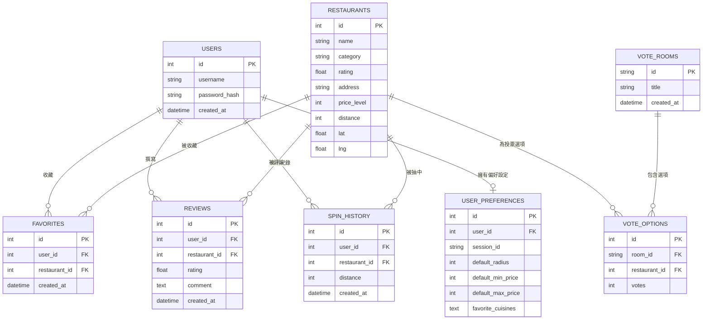

# 隨便吃什麼都好 — 資料庫設計文件 (DB_DESIGN.md)

> 本文件依據 `docs/PRD.md`、`docs/ARCHITECTURE.md` 與 `docs/FLOWCHART.md` 的功能需求，完整說明系統所使用的 SQLite 資料庫結構、欄位定義、資料表關聯，以及對應的 Python SQLAlchemy Model 程式碼。

---

## 1. ER 圖（實體關係圖）



---

## 2. 資料表詳細說明

### 2.1 `users` — 使用者帳號

| 欄位 | 型別 | 必填 | 說明 |
|---|---|---|---|
| `id` | INTEGER | ✅ PK | 自動遞增主鍵 |
| `username` | VARCHAR(80) | ✅ UNIQUE | 唯一使用者名稱（不可重複） |
| `password_hash` | VARCHAR(120) | ✅ | 經 Bcrypt 加密後的密碼 Hash |
| `created_at` | DATETIME | ✅ | 帳號建立時間（預設為當下 UTC 時間） |

**關聯**：一個 User 可擁有多個 Favorites、Reviews、SpinHistory，以及至多一筆 UserPreference。

---

### 2.2 `restaurants` — 餐廳資料

| 欄位 | 型別 | 必填 | 說明 |
|---|---|---|---|
| `id` | INTEGER | ✅ PK | 自動遞增主鍵 |
| `name` | VARCHAR(120) | ✅ | 餐廳名稱 |
| `category` | VARCHAR(50) | ✅ | 料理類型（如「日式」「台式」「火鍋」） |
| `rating` | FLOAT | ✅ | 平均評分（0.0 ~ 5.0）；每次新增評論後自動重算 |
| `address` | VARCHAR(255) | ✅ | 餐廳地址 |
| `price_level` | INTEGER | ✅ | 價格等級：1=平價($)、2=中等($$)、3=昂貴($$$)、4=奢華($$$$) |
| `distance` | INTEGER | ✅ | 距離市中心的大約距離（單位：公尺） |
| `lat` | FLOAT | ❌ | 緯度（選填，供未來地圖 API 整合使用） |
| `lng` | FLOAT | ❌ | 經度（選填，供未來地圖 API 整合使用） |

**關聯**：一間 Restaurant 可被多個 Favorites、Reviews、SpinHistory 及 VoteOptions 所參照。

---

### 2.3 `favorites` — 會員收藏

| 欄位 | 型別 | 必填 | 說明 |
|---|---|---|---|
| `id` | INTEGER | ✅ PK | 自動遞增主鍵 |
| `user_id` | INTEGER | ✅ FK → `users.id` | 收藏者的使用者 ID（刪除 User 時 CASCADE 刪除） |
| `restaurant_id` | INTEGER | ✅ FK → `restaurants.id` | 被收藏的餐廳 ID（刪除 Restaurant 時 CASCADE 刪除） |
| `created_at` | DATETIME | ✅ | 收藏建立時間 |

**設計說明**：使用者與餐廳之間的多對多關聯表，每筆紀錄代表一個收藏配對，透過 AJAX（`/favorite/toggle`）動態新增或刪除。

---

### 2.4 `reviews` — 評論與評分

| 欄位 | 型別 | 必填 | 說明 |
|---|---|---|---|
| `id` | INTEGER | ✅ PK | 自動遞增主鍵 |
| `user_id` | INTEGER | ✅ FK → `users.id` | 評論者的使用者 ID |
| `restaurant_id` | INTEGER | ✅ FK → `restaurants.id` | 被評論的餐廳 ID |
| `rating` | FLOAT | ✅ | 本次評分（1.0 ~ 5.0） |
| `comment` | TEXT | ✅ | 評論內文 |
| `created_at` | DATETIME | ✅ | 評論提交時間 |

**設計說明**：每次新增評論後，後端自動計算該餐廳所有評論的平均分數，並更新 `restaurants.rating`，確保評分即時反映真實回饋。

---

### 2.5 `spin_history` — 抽選歷史紀錄

| 欄位 | 型別 | 必填 | 說明 |
|---|---|---|---|
| `id` | INTEGER | ✅ PK | 自動遞增主鍵 |
| `user_id` | INTEGER | ✅ FK → `users.id` | 進行抽選的使用者 ID |
| `restaurant_id` | INTEGER | ✅ FK → `restaurants.id` | 該次被抽中的餐廳 ID |
| `distance` | INTEGER | ❌ | 當時設定的搜尋距離範圍（公尺），方便回顧查詢條件 |
| `created_at` | DATETIME | ✅ | 抽選時間 |

**設計說明**：僅在使用者已登入時才記錄，方便於「歷史紀錄」頁展示過去的抽選結果，協助避免重複推薦。

---

### 2.6 `user_preferences` — 個人偏好設定

| 欄位 | 型別 | 必填 | 說明 |
|---|---|---|---|
| `id` | INTEGER | ✅ PK | 自動遞增主鍵 |
| `user_id` | INTEGER | ❌ FK → `users.id` | 對應登入使用者的 ID（未登入時為 NULL） |
| `session_id` | VARCHAR(100) | ❌ | 對應未登入訪客的 Session ID |
| `default_radius` | INTEGER | ✅ | 預設搜尋距離（預設：3000 公尺） |
| `default_min_price` | INTEGER | ✅ | 預設最低價格等級（預設：1） |
| `default_max_price` | INTEGER | ✅ | 預設最高價格等級（預設：3） |
| `favorite_cuisines` | TEXT | ✅ | 慣用料理類型（以 JSON 陣列字串儲存，如 `["日式","台式"]`） |

**設計說明**：同時支援登入會員（以 `user_id` 識別）與未登入訪客（以 `session_id` 識別）的偏好儲存，保留擴充彈性。

---

### 2.7 `vote_rooms` — 投票房間

| 欄位 | 型別 | 必填 | 說明 |
|---|---|---|---|
| `id` | VARCHAR(36) | ✅ PK | 短碼 UUID（取 UUID v4 前 8 碼），作為房間唯一識別碼與 URL 參數 |
| `title` | VARCHAR(100) | ✅ | 投票房間標題（如「今晚要吃什麼？」） |
| `created_at` | DATETIME | ✅ | 房間建立時間 |

**設計說明**：PK 使用短碼 UUID 字串（而非自增整數），方便作為可分享的 URL 路徑（如 `/vote/a3f9bc12`），同時避免連號帶來的房間枚舉攻擊風險。

---

### 2.8 `vote_options` — 投票選項

| 欄位 | 型別 | 必填 | 說明 |
|---|---|---|---|
| `id` | INTEGER | ✅ PK | 自動遞增主鍵 |
| `room_id` | VARCHAR(36) | ✅ FK → `vote_rooms.id` | 所屬的投票房間 ID |
| `restaurant_id` | INTEGER | ✅ FK → `restaurants.id` | 此選項對應的餐廳 ID |
| `votes` | INTEGER | ✅ | 目前得票數（預設為 0） |

**設計說明**：建立房間時隨機抽選出 N 間候選餐廳，每間各建立一筆 VoteOption。使用者投票時直接對 `votes` 欄位 +1，並透過 AJAX 輪詢即時展示各選項的票數百分比。

---

## 3. SQL 建表語法

以下為完整的 SQLite 建表 SQL，與 `app/models/` 下的 SQLAlchemy Model 定義完全對應。

```sql
-- ==========================================
-- 隨便吃什麼都好 — SQLite 建表語法
-- 生成工具：Flask-SQLAlchemy db.create_all()
-- 建議透過 run.py 自動建立，無需手動執行
-- ==========================================

-- 使用者帳號
CREATE TABLE IF NOT EXISTS users (
    id INTEGER PRIMARY KEY AUTOINCREMENT,
    username VARCHAR(80) NOT NULL UNIQUE,
    password_hash VARCHAR(120) NOT NULL,
    created_at DATETIME NOT NULL DEFAULT CURRENT_TIMESTAMP
);

-- 餐廳資料
CREATE TABLE IF NOT EXISTS restaurants (
    id INTEGER PRIMARY KEY AUTOINCREMENT,
    name VARCHAR(120) NOT NULL,
    category VARCHAR(50) NOT NULL,
    rating FLOAT NOT NULL DEFAULT 0.0,
    address VARCHAR(255) NOT NULL,
    price_level INTEGER NOT NULL,  -- 1:$  2:$$  3:$$$  4:$$$$
    distance INTEGER NOT NULL,     -- 單位：公尺
    lat FLOAT,
    lng FLOAT
);

-- 會員收藏
CREATE TABLE IF NOT EXISTS favorites (
    id INTEGER PRIMARY KEY AUTOINCREMENT,
    user_id INTEGER NOT NULL REFERENCES users(id) ON DELETE CASCADE,
    restaurant_id INTEGER NOT NULL REFERENCES restaurants(id) ON DELETE CASCADE,
    created_at DATETIME NOT NULL DEFAULT CURRENT_TIMESTAMP
);

-- 餐廳評論與評分
CREATE TABLE IF NOT EXISTS reviews (
    id INTEGER PRIMARY KEY AUTOINCREMENT,
    user_id INTEGER NOT NULL REFERENCES users(id) ON DELETE CASCADE,
    restaurant_id INTEGER NOT NULL REFERENCES restaurants(id) ON DELETE CASCADE,
    rating FLOAT NOT NULL,
    comment TEXT NOT NULL,
    created_at DATETIME NOT NULL DEFAULT CURRENT_TIMESTAMP
);

-- 隨機抽選歷史紀錄
CREATE TABLE IF NOT EXISTS spin_history (
    id INTEGER PRIMARY KEY AUTOINCREMENT,
    user_id INTEGER NOT NULL REFERENCES users(id) ON DELETE CASCADE,
    restaurant_id INTEGER NOT NULL REFERENCES restaurants(id) ON DELETE CASCADE,
    distance INTEGER,
    created_at DATETIME NOT NULL DEFAULT CURRENT_TIMESTAMP
);

-- 使用者個人偏好設定
CREATE TABLE IF NOT EXISTS user_preferences (
    id INTEGER PRIMARY KEY AUTOINCREMENT,
    user_id INTEGER REFERENCES users(id) ON DELETE CASCADE,
    session_id VARCHAR(100),
    default_radius INTEGER NOT NULL DEFAULT 3000,
    default_min_price INTEGER NOT NULL DEFAULT 1,
    default_max_price INTEGER NOT NULL DEFAULT 3,
    favorite_cuisines TEXT NOT NULL DEFAULT '[]'
);

-- 多人投票房間
CREATE TABLE IF NOT EXISTS vote_rooms (
    id VARCHAR(36) PRIMARY KEY,
    title VARCHAR(100) NOT NULL,
    created_at DATETIME NOT NULL DEFAULT CURRENT_TIMESTAMP
);

-- 投票房間選項
CREATE TABLE IF NOT EXISTS vote_options (
    id INTEGER PRIMARY KEY AUTOINCREMENT,
    room_id VARCHAR(36) NOT NULL REFERENCES vote_rooms(id) ON DELETE CASCADE,
    restaurant_id INTEGER NOT NULL REFERENCES restaurants(id) ON DELETE CASCADE,
    votes INTEGER NOT NULL DEFAULT 0
);
```

---

## 4. Python Model 程式碼一覽

所有 Model 均位於 `app/models/` 資料夾，透過 `app/models/__init__.py` 統一初始化 `db = SQLAlchemy()` 實例，並在 `app/__init__.py` 的 `create_app()` 工廠函式中以 `db.init_app(app)` 掛載。

| 檔案 | Model 類別 | 資料表 |
|---|---|---|
| [`app/models/__init__.py`](../app/models/__init__.py) | `db`（SQLAlchemy 實例） | — |
| [`app/models/user.py`](../app/models/user.py) | `User` | `users` |
| [`app/models/restaurant.py`](../app/models/restaurant.py) | `Restaurant` | `restaurants` |
| [`app/models/favorite.py`](../app/models/favorite.py) | `Favorite` | `favorites` |
| [`app/models/review.py`](../app/models/review.py) | `Review` | `reviews` |
| [`app/models/history.py`](../app/models/history.py) | `SpinHistory` | `spin_history` |
| [`app/models/preference.py`](../app/models/preference.py) | `UserPreference` | `user_preferences` |
| [`app/models/vote.py`](../app/models/vote.py) | `VoteRoom`, `VoteOption` | `vote_rooms`, `vote_options` |

### 初始化方式

資料庫**無需手動執行 SQL**，執行以下指令即可自動建立所有資料表並填入初始測試資料：

```bash
py run.py
```

`run.py` 會在啟動伺服器前呼叫 `db.create_all()`，若資料表尚未存在則自動建立；若 `restaurants` 表為空，則自動填入 15 間台中熱門餐廳的種子資料（Seed Data）。

---

## 5. 關聯彙整

| 關聯 | 類型 | 說明 |
|---|---|---|
| User → Favorites | 一對多 | 一個用戶可收藏多間餐廳 |
| Restaurant → Favorites | 一對多 | 一間餐廳可被多人收藏 |
| User → Reviews | 一對多 | 一個用戶可對多間餐廳撰寫評論 |
| Restaurant → Reviews | 一對多 | 一間餐廳可有多筆評論 |
| User → SpinHistory | 一對多 | 一個用戶可有多筆抽選紀錄 |
| Restaurant → SpinHistory | 一對多 | 一間餐廳可被多次抽中並記錄 |
| User → UserPreference | 一對一 | 一個用戶最多一筆偏好設定 |
| VoteRoom → VoteOptions | 一對多 | 一個投票房間包含多個候選選項 |
| Restaurant → VoteOptions | 一對多 | 一間餐廳可出現在多個不同的投票房間選項中 |
