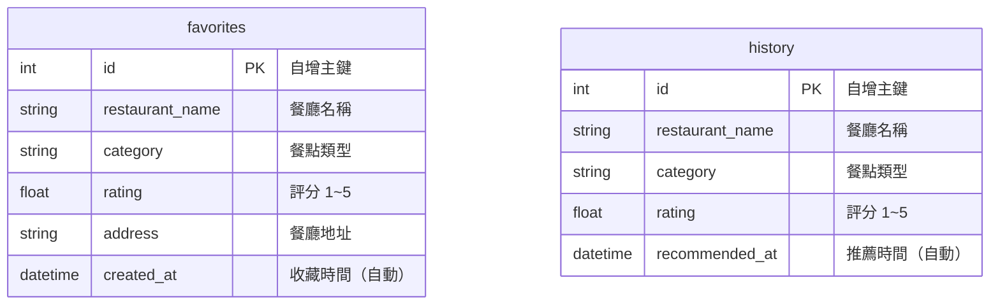

# 資料庫設計文件（DB Design）- F-05 收藏與歷史紀錄

**專案名稱：** 隨便吃什麼都好（Let's Just Eat）  
**功能模組：** F-05 收藏與歷史紀錄 (Favorites & History)  
**對應 PRD：** [docs/PRD_F05.md](file:///c:/Users/USER/very-good/docs/PRD_F05.md)  
**狀態：** 正式版  
**撰寫日期：** 2026-05-27  

---

## 1. ER 圖（實體關係圖）

兩張資料表採用**非正規化（Denormalized）**設計，直接在表內儲存餐廳資訊，  
不依賴外部 `restaurants` 資料表外鍵，降低查詢複雜度，適合輕量級 MVP 開發。



---

## 2. 資料表詳細說明

### 2.1 `favorites` 資料表（收藏餐廳）

記錄使用者加入收藏的餐廳完整資訊。

| 欄位名稱 | 資料型態 | 必填 | 預設值 | 說明 |
| :--- | :--- | :--- | :--- | :--- |
| `id` | INTEGER | 是 | 自增 | 唯一識別碼（Primary Key） |
| `restaurant_name` | VARCHAR(100) | 是 | — | 餐廳名稱 |
| `category` | VARCHAR(50) | 否 | NULL | 餐點類型（如：日式、中式、美式） |
| `rating` | FLOAT | 否 | NULL | 餐廳評分（1.0 ~ 5.0） |
| `address` | VARCHAR(200) | 否 | NULL | 餐廳地址 |
| `created_at` | DATETIME | 是 | CURRENT_TIMESTAMP | 收藏時間（系統自動填入） |

---

### 2.2 `history` 資料表（歷史推薦紀錄）

系統自動記錄每次隨機推薦的餐廳資訊。

| 欄位名稱 | 資料型態 | 必填 | 預設值 | 說明 |
| :--- | :--- | :--- | :--- | :--- |
| `id` | INTEGER | 是 | 自增 | 唯一識別碼（Primary Key） |
| `restaurant_name` | VARCHAR(100) | 是 | — | 餐廳名稱 |
| `category` | VARCHAR(50) | 否 | NULL | 餐點類型 |
| `rating` | FLOAT | 否 | NULL | 餐廳評分（1.0 ~ 5.0） |
| `recommended_at` | DATETIME | 是 | CURRENT_TIMESTAMP | 推薦時間（系統自動填入） |

---

## 3. SQL 建表語法（SQLite）

完整建表語法請參考 [`database/schema.sql`](file:///c:/Users/USER/very-good/database/schema.sql)。

```sql
-- 收藏資料表
CREATE TABLE IF NOT EXISTS favorites (
    id INTEGER PRIMARY KEY AUTOINCREMENT,
    restaurant_name VARCHAR(100) NOT NULL,
    category VARCHAR(50),
    rating FLOAT CHECK(rating >= 1.0 AND rating <= 5.0),
    address VARCHAR(200),
    created_at DATETIME DEFAULT CURRENT_TIMESTAMP NOT NULL
);

-- 歷史推薦紀錄資料表
CREATE TABLE IF NOT EXISTS history (
    id INTEGER PRIMARY KEY AUTOINCREMENT,
    restaurant_name VARCHAR(100) NOT NULL,
    category VARCHAR(50),
    rating FLOAT CHECK(rating >= 1.0 AND rating <= 5.0),
    recommended_at DATETIME DEFAULT CURRENT_TIMESTAMP NOT NULL
);
```

---

## 4. Python Model 程式碼（SQLAlchemy ORM）

| 功能 | `favorites` | `history` |
| :--- | :--- | :--- |
| 新增 | `Favorite.create(...)` | `History.create(...)` |
| 查詢全部 | `Favorite.get_all()` | `History.get_all()` |
| 依 ID 查詢 | `Favorite.get_by_id(id)` | `History.get_by_id(id)` |
| 更新 | `Favorite.update(id, data)` | — |
| 刪除 | `Favorite.delete(id)` | `History.delete(id)` |
| 清空全部 | — | `History.clear_all()` |

- **Model 檔案**：[`app/models/favorite.py`](file:///c:/Users/USER/very-good/app/models/favorite.py)、[`app/models/history.py`](file:///c:/Users/USER/very-good/app/models/history.py)
- **ORM 框架**：Flask-SQLAlchemy
- **資料庫**：SQLite（`instance/database.db`）
- **時間欄位**：`created_at` / `recommended_at` 皆使用 `datetime.utcnow` 自動填入
