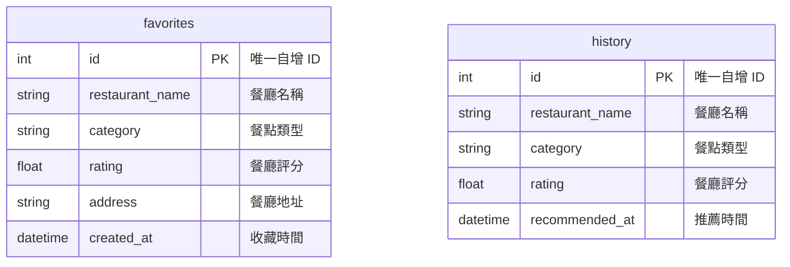

# 資料庫設計文件 - F-05 收藏與歷史紀錄

**專案名稱：** 隨便吃什麼都好 (Let's Just Eat)  
**功能模組：** F-05 收藏與歷史紀錄 (Favorites & Recommendation History)  
**狀態：** 已核准  
**技術架構：** Flask-SQLAlchemy (ORM) + SQLite  

---

## 1. ER 圖（實體關係圖）
下圖展示了 `favorites`（我的收藏）與 `history`（推薦歷史紀錄）兩個資料表的結構設計。本模組使用獨立自持的扁平化結構設計，以便快速讀寫與系統解耦。



---

## 2. 資料表詳細說明

### 2.1 `favorites` 資料表 (我的收藏)
記錄使用者所收藏的餐廳詳細資訊。

* **Primary Key (PK)**: `id` (INTEGER AUTOINCREMENT)
* **時間戳記**: `created_at` (自動記錄建立時間)

| 欄位名稱 | 資料型態 | 必填 | 預設值 | 說明 |
| :--- | :--- | :--- | :--- | :--- |
| `id` | INTEGER | 是 | (自增) | 收藏紀錄唯一識別碼 |
| `restaurant_name` | TEXT | 是 | - | 餐廳名稱 |
| `category` | TEXT | 否 | NULL | 餐點類型 (如: 義式、日式、火鍋) |
| `rating` | REAL | 否 | NULL | 餐廳評分 (0.0 ~ 5.0) |
| `address` | TEXT | 否 | NULL | 餐廳地址 |
| `created_at` | DATETIME | 是 | CURRENT_TIMESTAMP | 收藏時間 |

---

### 2.2 `history` 資料表 (歷史推薦紀錄)
記錄使用者隨機抽選/推薦餐廳的歷史印記。

* **Primary Key (PK)**: `id` (INTEGER AUTOINCREMENT)
* **時間戳記**: `recommended_at` (自動記錄推薦時間)

| 欄位名稱 | 資料型態 | 必填 | 預設值 | 說明 |
| :--- | :--- | :--- | :--- | :--- |
| `id` | INTEGER | 是 | (自增) | 歷史紀錄唯一識別碼 |
| `restaurant_name` | TEXT | 是 | - | 被推薦的餐廳名稱 |
| `category` | TEXT | 否 | NULL | 餐點類型 |
| `rating` | REAL | 否 | NULL | 餐廳評分 |
| `recommended_at` | DATETIME | 是 | CURRENT_TIMESTAMP | 推薦系統產出時間 |

---

## 3. SQL 建表 DDL 語法 (SQLite)
本專案開發環境使用 SQLite，以下為對應之建表 SQL 語法（儲存於 `database/schema.sql`）:

```sql
-- 1. 建立收藏資料表
CREATE TABLE IF NOT EXISTS favorites (
    id INTEGER PRIMARY KEY AUTOINCREMENT,
    restaurant_name TEXT NOT NULL,
    category TEXT,
    rating REAL,
    address TEXT,
    created_at DATETIME DEFAULT CURRENT_TIMESTAMP NOT NULL
);

-- 2. 建立歷史推薦紀錄資料表
CREATE TABLE IF NOT EXISTS history (
    id INTEGER PRIMARY KEY AUTOINCREMENT,
    restaurant_name TEXT NOT NULL,
    category TEXT,
    rating REAL,
    recommended_at DATETIME DEFAULT CURRENT_TIMESTAMP NOT NULL
);

-- 3. 建立索引優化搜尋效能
CREATE INDEX IF NOT EXISTS idx_favorites_name ON favorites(restaurant_name);
CREATE INDEX IF NOT EXISTS idx_history_name ON history(restaurant_name);
```

---

## 4. Python Model 對應規範
本模組基於 Flask-SQLAlchemy 3.x 進行 ORM 開發，模型類別定義在：
- `app/models/favorite.py` -> 映射至 `favorites` 資料表
- `app/models/history.py` -> 映射至 `history` 資料表

皆封裝有完整的 CRUD 方法：
- `create()`: 新增單筆記錄
- `delete()`: 刪除單筆記錄
- `get_all()`: 依時間降序（desc）取得所有記錄
- `get_by_id()`: 依 ID 取得單筆詳細記錄
- `update()`: 動態更新欄位資料
