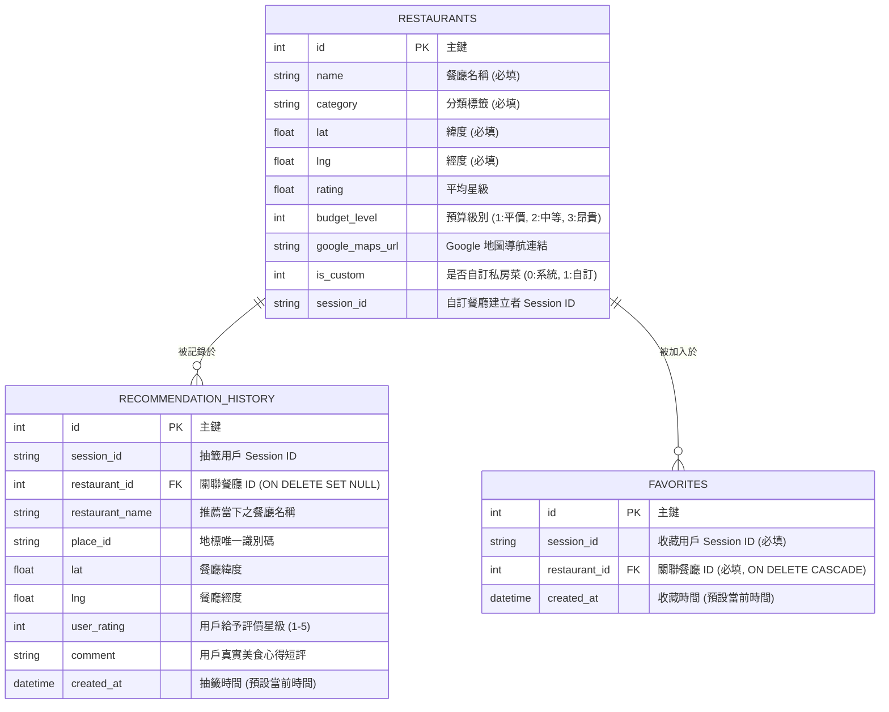

# 隨便吃什麼都好系統 - 資料庫設計與 Model 實作文件 (DB_DESIGN.md)

本文件詳細記錄了「隨便吃什麼都好 (FlavorFind)」系統的 SQLite 資料庫綱要 (Schema) 設計、實體關係圖 (ERD)、各資料表的欄位詳細規範，以及後端 Python Models 的實作結構。本系統基於 SQLite 3 資料庫，以無感 Session 機制實現多用戶的隱私與資料安全隔離。

---

## 1. 實體關係圖 (ER Diagram)

我們使用 Mermaid 實體關係圖語法，展示系統中三個核心資料表（餐廳、抽籤歷史紀錄、口袋收藏名單）之間的關聯：



---

## 2. 資料表詳細欄位規範

### A. 餐廳資料表 (`restaurants`)
此表儲存系統內建的全部預設餐廳，以及使用者所新增的私房口袋餐廳。
* 自訂私房餐廳藉由 `is_custom = 1` 標記，並儲存該用戶的 `session_id`，確保僅該用戶能看見與抽取。

| 欄位名稱 | 資料型別 (SQLite) | 允許空值 | 預設值 | 主鍵/外鍵 | 欄位用途與說明 |
| --- | --- | --- | --- | --- | --- |
| `id` | `INTEGER` | 否 | - | **PK** | 自動遞增之唯一主鍵。 |
| `name` | `TEXT` | 否 | - | - | 餐廳名稱（例如：刁民酸菜魚）。 |
| `category` | `TEXT` | 否 | - | - | 餐廳種類標籤（例如：火鍋、日式、小吃）。 |
| `lat` | `REAL` | 否 | - | - | 餐廳經緯度：緯度（Latitude）。 |
| `lng` | `REAL` | 否 | - | - | 餐廳經緯度：經度（Longitude）。 |
| `rating` | `REAL` | 是 | `NULL` | - | 餐廳平均評分 (1.0 - 5.0)，自訂私房菜預設給 5.0。 |
| `budget_level`| `INTEGER` | 否 | `1` | - | 預算等級 (1: 平價 $, 2: 中等 $$, 3: 昂貴 $$$)。 |
| `google_maps_url` | `TEXT` | 是 | `NULL` | - | Google Maps 商家導航跳轉網址。 |
| `is_custom` | `INTEGER` | 否 | `0` | - | 是否為使用者自訂私房菜 (0: 否, 1: 是)。 |
| `session_id` | `TEXT` | 是 | `NULL` | - | 自訂此私房菜之使用者 Session ID。 |

---

### B. 推薦歷史與評論日誌表 (`recommendation_history`)
記錄使用者每次隨機推薦成功的歷史紀錄，並支援使用者非同步對該次抽籤進行評分與撰寫評論。
* 當對應餐廳被刪除時，外鍵設定為 `ON DELETE SET NULL`，保留歷史推薦文字紀錄。

| 欄位名稱 | 資料型別 (SQLite) | 允許空值 | 預設值 | 主鍵/外鍵 | 欄位用途與說明 |
| --- | --- | --- | --- | --- | --- |
| `id` | `INTEGER` | 否 | - | **PK** | 自動遞增之唯一主鍵。 |
| `session_id` | `TEXT` | 是 | `NULL` | - | 抽籤使用者的 Session 識別碼。 |
| `restaurant_id`| `INTEGER` | 是 | `NULL` | **FK** | 關聯到 `restaurants.id`，允許隨餐廳刪除置空。 |
| `restaurant_name`| `TEXT` | 否 | - | - | 推薦當下的餐廳名稱（防止餐廳被刪除後歷史斷聯無名）。|
| `place_id` | `TEXT` | 是 | `NULL` | - | Google 地標識別碼。 |
| `lat` | `REAL` | 是 | `NULL` | - | 當時餐廳之緯度。 |
| `lng` | `REAL` | 是 | `NULL` | - | 當時餐廳之經度。 |
| `user_rating` | `INTEGER` | 是 | `NULL` | - | 使用者對該次美食體驗的評分星等 (1-5 星)。 |
| `comment` | `TEXT` | 是 | `NULL` | - | 使用者手寫的真實心得評語短記。 |
| `created_at` | `DATETIME` | 否 | `CURRENT_TIMESTAMP` | - | 推薦產生的時間戳記。 |

---

### C. 口袋收藏名單表 (`favorites`)
儲存使用者手動收藏的「口袋名單」餐廳關係對照。
* 具備 `session_id` 與 `restaurant_id` 的 `UNIQUE` 聯合唯一索引，防止重複收藏。
* 當對應餐廳被刪除時，關聯紀錄自動觸發 `ON DELETE CASCADE` 連帶清除。

| 欄位名稱 | 資料型別 (SQLite) | 允許空值 | 預設值 | 主鍵/外鍵 | 欄位用途與說明 |
| --- | --- | --- | --- | --- | --- |
| `id` | `INTEGER` | 否 | - | **PK** | 自動遞增之唯一主鍵。 |
| `session_id` | `TEXT` | 否 | - | - | 收藏該餐廳之使用者的 Session 識別碼。 |
| `restaurant_id`| `INTEGER` | 否 | - | **FK** | 關聯到 `restaurants.id`，設有級聯刪除。 |
| `created_at` | `DATETIME` | 否 | `CURRENT_TIMESTAMP` | - | 收藏被建立的時間戳記。 |

---

## 3. SQL 建表語法 (DDL)

完整保存在 [database/schema.sql](file:///Users/huihsin/very-good-1/database/schema.sql) 中，語法符合 SQLite 3 標準：

```sql
DROP TABLE IF EXISTS restaurants;
DROP TABLE IF EXISTS recommendation_history;
DROP TABLE IF EXISTS favorites;

-- 1. 餐廳資料表
CREATE TABLE restaurants (
    id INTEGER PRIMARY KEY AUTOINCREMENT,
    name TEXT NOT NULL,
    category TEXT NOT NULL,
    lat REAL NOT NULL,
    lng REAL NOT NULL,
    rating REAL,
    budget_level INTEGER DEFAULT 1, -- 1: 平價, 2: 中等, 3: 昂貴
    google_maps_url TEXT,
    is_custom INTEGER DEFAULT 0,    -- 0: 系統預設, 1: 使用者自訂
    session_id TEXT                 -- 關聯建立者的 session_id，避免他人看見自訂餐廳
);

-- 2. 推薦歷史與評論日誌表
CREATE TABLE recommendation_history (
    id INTEGER PRIMARY KEY AUTOINCREMENT,
    session_id TEXT,
    restaurant_id INTEGER,
    restaurant_name TEXT NOT NULL,
    place_id TEXT,
    lat REAL,
    lng REAL,
    user_rating INTEGER,            -- 使用者給出的星星 (1-5)
    comment TEXT,                   -- 使用者的評論內容
    created_at DATETIME DEFAULT CURRENT_TIMESTAMP,
    FOREIGN KEY(restaurant_id) REFERENCES restaurants(id) ON DELETE SET NULL
);

-- 3. 會員收藏 (口袋名單) 表
CREATE TABLE favorites (
    id INTEGER PRIMARY KEY AUTOINCREMENT,
    session_id TEXT NOT NULL,
    restaurant_id INTEGER NOT NULL,
    created_at DATETIME DEFAULT CURRENT_TIMESTAMP,
    FOREIGN KEY(restaurant_id) REFERENCES restaurants(id) ON DELETE CASCADE,
    UNIQUE(session_id, restaurant_id)
);
```

---

## 4. Python Models CRUD 程式碼實作結構

本系統採用輕量級 `sqlite3` 原生模組，以 Python 獨立模型（Model）檔案來封裝所有對資料表的讀寫與篩選運作：

### A. 資料庫連線配置 ([database.py](file:///Users/huihsin/very-good-1/app/models/database.py))
```python
import sqlite3
import os

def get_db_connection():
    """
    建立並回傳 SQLite 資料庫的安全連線。
    設定 row_factory = sqlite3.Row 讓查詢結果能透過欄位鍵值 (Key) 字典化存取。
    """
    db_path = os.path.join(os.getcwd(), 'instance', 'database.db')
    conn = sqlite3.connect(db_path)
    conn.row_factory = sqlite3.Row
    return conn
```

### B. 餐廳推薦模型 ([restaurant.py](file:///Users/huihsin/very-good-1/app/models/restaurant.py))
負責系統預設與自訂餐廳的 CRUD、Haversine 距離計算，以及**多條件混合過濾推薦演算法**。
* **Create**: `add_custom_restaurant(session_id, name, category, lat, lng, ...)` — 寫入私房自訂餐廳。
* **Read (All)**: `get_all_restaurants(session_id)` — 依 session 讀取所有可見餐廳。
* **Recommendation Query (Business Logic)**: `recommend_restaurant(...)` — 精準綜合預算、避雷 excluded 標籤、最低評分、距離半徑過濾與 Fallback 等複雜篩選機制進行隨機抽取。

### C. 口袋收藏模型 ([favorite.py](file:///Users/huihsin/very-good-1/app/models/favorite.py))
負責口袋名單的收藏關係維護。
* **Create (Add Relation)**: `add_favorite(session_id, restaurant_id)` — 將指定餐廳加入口袋。
* **Delete (Remove Relation)**: `remove_favorite(session_id, restaurant_id)` — 取消收藏。
* **Read (Check Status)**: `is_favorite(session_id, restaurant_id)` — 檢查是否已被該 Session 收藏。
* **Read (All Favorites)**: `get_favorites(session_id)` — 讀取該 Session 所有已收藏的餐廳詳情列表。

### D. 歷史與評論模型 ([history.py](file:///Users/huihsin/very-good-1/app/models/history.py))
負責抽籤歷史日誌與美食評論的回饋維護。
* **Create**: `add_history(session_id, restaurant_id, restaurant_name, lat, lng)` — 紀錄推薦產生的紀錄。
* **Read (All)**: `get_history(session_id)` — 依時間降序（由新到舊）讀取該用戶的所有探險日誌。
* **Update (Feedback)**: `update_history_feedback(session_id, history_id, user_rating, comment)` — 異步更新特定的評分星等與文字小語。
* **Delete**: `delete_history(session_id, history_id)` — 允許用戶手動刪除單筆探險歷史紀錄。
