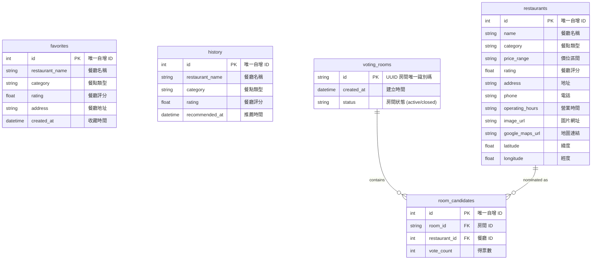

# 資料庫設計文件 - F-05 收藏與歷史紀錄 & F-06 投票房間

**專案名稱：** 隨便吃什麼都好 (Let's Just Eat)  
**功能模組：** F-05 收藏與歷史紀錄 (Favorites & Recommendation History) & F-06 投票房間 (Voting Room)  
**狀態：** 已核准  
**技術架構：** Flask-SQLAlchemy (ORM) + SQLite  

---

## 1. ER 圖（實體關係圖）
下圖展示了資料表的結構設計與關聯。



---

## 2. 資料表詳細說明

### 2.1 `favorites` 資料表 (我的收藏)
記錄使用者所收藏的餐廳詳細資訊。

* **Primary Key (PK)**: `id` (INTEGER AUTOINCREMENT)
* **時間戳記**: `created_at` (自動記錄建立時間)

| 欄位名稱 | 資料型態 | 必填 | 預設值 | 說明 |
| :--- | :--- | :--- | :--- | :--- |
| `id` | INTEGER | 是 | (自增) | 收藏紀錄唯一識別碼 |
| `restaurant_name` | TEXT | 是 | - | 餐廳名稱 |
| `category` | TEXT | 否 | NULL | 餐點類型 (如: 義式、日式、火鍋) |
| `rating` | REAL | 否 | NULL | 餐廳評分 (0.0 ~ 5.0) |
| `address` | TEXT | 否 | NULL | 餐廳地址 |
| `created_at` | DATETIME | 是 | CURRENT_TIMESTAMP | 收藏時間 |

---

### 2.2 `history` 資料表 (歷史推薦紀錄)
記錄使用者隨機抽選/推薦餐廳的歷史印記。

* **Primary Key (PK)**: `id` (INTEGER AUTOINCREMENT)
* **時間戳記**: `recommended_at` (自動記錄推薦時間)

| 欄位名稱 | 資料型態 | 必填 | 預設值 | 說明 |
| :--- | :--- | :--- | :--- | :--- |
| `id` | INTEGER | 是 | (自增) | 歷史紀錄唯一識別碼 |
| `restaurant_name` | TEXT | 是 | - | 被推薦的餐廳名稱 |
| `category` | TEXT | 否 | NULL | 餐點類型 |
| `rating` | REAL | 否 | NULL | 餐廳評分 |
| `recommended_at` | DATETIME | 是 | CURRENT_TIMESTAMP | 推薦系統產出時間 |

---

### 2.3 `voting_rooms` 資料表 (投票房間)
記錄建立的投票房間及其狀態。

* **Primary Key (PK)**: `id` (TEXT/UUID)
* **時間戳記**: `created_at` (自動記錄建立時間)

| 欄位名稱 | 資料型態 | 必填 | 預設值 | 說明 |
| :--- | :--- | :--- | :--- | :--- |
| `id` | TEXT | 是 | - | 投票房間唯一 UUID (作為專屬網址一部分) |
| `created_at` | TIMESTAMP | 是 | CURRENT_TIMESTAMP | 房間建立時間 |
| `status` | TEXT | 是 | 'active' | 房間狀態：'active' (投票中) 或 'closed' (已結算) |

---

### 2.4 `room_candidates` 資料表 (房間候選餐廳)
記錄投票房間內的候選餐廳及當前得票數。

* **Primary Key (PK)**: `id` (INTEGER AUTOINCREMENT)
* **Foreign Keys (FK)**: 
  * `room_id` 關聯 `voting_rooms(id)` (ON DELETE CASCADE)
  * `restaurant_id` 關聯 `restaurants(id)` (ON DELETE CASCADE)

| 欄位名稱 | 資料型態 | 必填 | 預設值 | 說明 |
| :--- | :--- | :--- | :--- | :--- |
| `id` | INTEGER | 是 | (自增) | 唯一識別碼 |
| `room_id` | TEXT | 是 | - | 關聯的投票房間 ID |
| `restaurant_id` | INTEGER | 是 | - | 關聯的餐廳 ID |
| `vote_count` | INTEGER | 是 | 0 | 該候選餐廳的累積得票數 |

---

## 3. SQL 建表 DDL 語法 (SQLite)
本專案開發環境使用 SQLite，以下為對應之建表 SQL 語法（儲存於 `database/schema.sql`）:

```sql
-- 1. 建立收藏資料表
CREATE TABLE IF NOT EXISTS favorites (
    id INTEGER PRIMARY KEY AUTOINCREMENT,
    restaurant_name TEXT NOT NULL,
    category TEXT,
    rating REAL,
    address TEXT,
    created_at DATETIME DEFAULT CURRENT_TIMESTAMP NOT NULL
);

-- 2. 建立歷史推薦紀錄資料表
CREATE TABLE IF NOT EXISTS history (
    id INTEGER PRIMARY KEY AUTOINCREMENT,
    restaurant_name TEXT NOT NULL,
    category TEXT,
    rating REAL,
    recommended_at DATETIME DEFAULT CURRENT_TIMESTAMP NOT NULL
);

-- 3. 建立索引優化搜尋效能
CREATE INDEX IF NOT EXISTS idx_favorites_name ON favorites(restaurant_name);
CREATE INDEX IF NOT EXISTS idx_history_name ON history(restaurant_name);

-- 4. 建立投票房間表
CREATE TABLE IF NOT EXISTS voting_rooms (
    id TEXT PRIMARY KEY,
    created_at TIMESTAMP DEFAULT CURRENT_TIMESTAMP NOT NULL,
    status TEXT DEFAULT 'active' NOT NULL
);

-- 5. 建立房間內的候選餐廳表
CREATE TABLE IF NOT EXISTS room_candidates (
    id INTEGER PRIMARY KEY AUTOINCREMENT,
    room_id TEXT NOT NULL,
    restaurant_id INTEGER NOT NULL,
    vote_count INTEGER DEFAULT 0 NOT NULL,
    FOREIGN KEY (room_id) REFERENCES voting_rooms (id) ON DELETE CASCADE,
    FOREIGN KEY (restaurant_id) REFERENCES restaurants (id) ON DELETE CASCADE
);

-- 6. 建立投票房間與候選餐廳索引
CREATE INDEX IF NOT EXISTS idx_room_candidates_room_id ON room_candidates(room_id);
```

---

## 4. Python Model 對應規範
本模組基於 Flask-SQLAlchemy 3.x 進行 ORM 開發，模型類別定義在：
- `app/models/favorite.py` -> 映射至 `favorites` 資料表
- `app/models/history.py` -> 映射至 `history` 資料表
- `app/models/restaurant.py` -> 映射至 `restaurants` 資料表
- `app/models/voting_room.py` -> 映射至 `voting_rooms` 資料表
- `app/models/room_candidate.py` -> 映射至 `room_candidates` 資料表

皆封裝有完整的 CRUD 方法：
- `create()`: 新增單筆記錄
- `delete()`: 刪除單筆記錄
- `get_all()`: 取得所有記錄
- `get_by_id()`: 依 ID 取得單筆詳細記錄
- `update()`: 動態更新欄位資料
- 額外輔助方法 (如 `increment_vote()`、`get_by_room_id()`)
