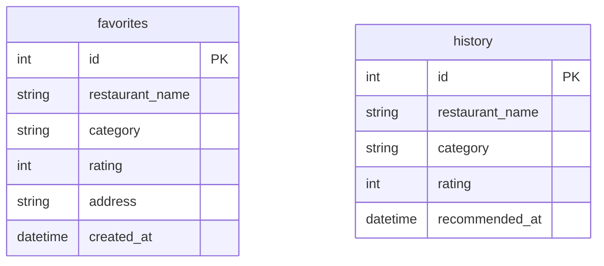

# 資料庫設計 - 收藏與歷史紀錄功能 (F-05)

## ER 圖（實體關係圖）



## 資料表詳細說明

### `favorites` 資料表
負責儲存使用者的收藏餐廳資訊。
* **id**: 整數型別 (INTEGER)，主鍵，自動遞增。
* **restaurant_name**: 字串型別 (TEXT/VARCHAR)，必填。
* **category**: 字串型別 (TEXT/VARCHAR)，非必填，記錄餐廳類別。
* **rating**: 整數型別 (INTEGER)，非必填，記錄評價星級。
* **address**: 字串型別 (TEXT/VARCHAR)，非必填，記錄餐廳地址。
* **created_at**: 日期時間 (DATETIME)，自動紀錄建立當下的時間。

### `history` 資料表
負責儲存使用者的推薦歷史紀錄。
* **id**: 整數型別 (INTEGER)，主鍵，自動遞增。
* **restaurant_name**: 字串型別 (TEXT/VARCHAR)，必填。
* **category**: 字串型別 (TEXT/VARCHAR)，非必填，記錄餐廳類別。
* **rating**: 整數型別 (INTEGER)，非必填，記錄評價星級。
* **recommended_at**: 日期時間 (DATETIME)，自動紀錄建立當下的時間。

## SQL 建表語法

建表語法儲存於 `database/schema.sql` 檔案中，詳細如下：

```sql
CREATE TABLE IF NOT EXISTS favorites (
    id INTEGER PRIMARY KEY AUTOINCREMENT,
    restaurant_name TEXT NOT NULL,
    category TEXT,
    rating INTEGER,
    address TEXT,
    created_at DATETIME DEFAULT CURRENT_TIMESTAMP
);

CREATE TABLE IF NOT EXISTS history (
    id INTEGER PRIMARY KEY AUTOINCREMENT,
    restaurant_name TEXT NOT NULL,
    category TEXT,
    rating INTEGER,
    recommended_at DATETIME DEFAULT CURRENT_TIMESTAMP
);
```
