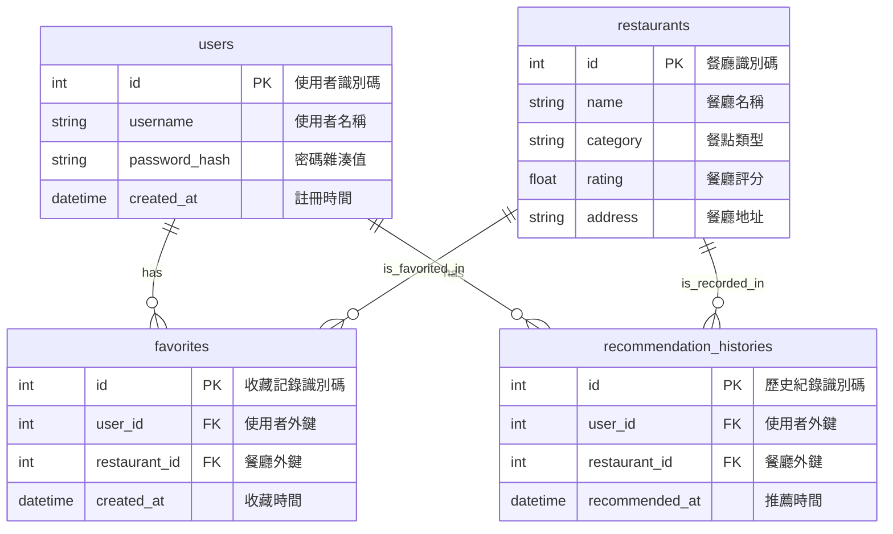

# 資料庫設計文件（Feature DB Design）- F-05 收藏與歷史紀錄

**專案名稱：** 隨便吃什麼都好（Let's Just Eat）  
**功能模組：** F-05 收藏與歷史紀錄 (Favorites & Recommendation History)  
**對應架構：** [docs/ARCHITECTURE_F05.md](file:///c:/Users/USER/very-good/docs/ARCHITECTURE_F05.md)  
**對應 PRD：** [docs/PRD_F05.md](file:///c:/Users/USER/very-good/docs/PRD_F05.md)  
**狀態：** 草稿  
**撰寫日期：** 2026-05-20  

---

## 1. ER 圖（實體關係圖）
下圖展示了使用者（`users`）、餐廳（`restaurants`）與 F-05 關聯資料表（`favorites`、`recommendation_histories`）之間的關聯性。



---

## 2. 資料表詳細說明

### 2.1 `favorites` 資料表 (收藏餐廳)
此表為多對多關係的關聯表，記錄使用者與收藏餐廳之間的對應關係。

*   **Primary Key (PK)**: `id`
*   **Foreign Key (FK)**:
    *   `user_id` 關聯至 `users(id)`
    *   `restaurant_id` 關聯至 `restaurants(id)`
*   **Unique Constraint (唯一限制)**: `(user_id, restaurant_id)` 建立聯合唯一索引，防範重複收藏。
*   **Cascade Option (級聯刪除)**: 當使用者或餐廳遭刪除時，關聯收藏紀錄自動刪除 (`ON DELETE CASCADE`)。

| 欄位名稱 | 資料型態 | 必填 | 預設值 | 說明 |
| :--- | :--- | :--- | :--- | :--- |
| `id` | INTEGER | 是 | (自增) | 收藏紀錄唯一識別碼 |
| `user_id` | INTEGER | 是 | - | 關聯使用者 ID |
| `restaurant_id` | INTEGER | 是 | - | 關聯餐廳 ID |
| `created_at` | DATETIME | 是 | CURRENT_TIMESTAMP | 收藏時間 |

---

### 2.2 `recommendation_histories` 資料表 (歷史推薦紀錄)
此表為一對多關係，記錄使用者每次隨機推薦所產生的歷史足跡。

*   **Primary Key (PK)**: `id`
*   **Foreign Key (FK)**:
    *   `user_id` 關聯至 `users(id)`
    *   `restaurant_id` 關聯至 `restaurants(id)`
*   **Cascade Option (級聯刪除)**: 當使用者或餐廳遭刪除時，關聯歷史紀錄自動刪除 (`ON DELETE CASCADE`)。

| 欄位名稱 | 資料型態 | 必填 | 預設值 | 說明 |
| :--- | :--- | :--- | :--- | :--- |
| `id` | INTEGER | 是 | (自增) | 歷史紀錄唯一識別碼 |
| `user_id` | INTEGER | 是 | - | 關聯使用者 ID |
| `restaurant_id` | INTEGER | 是 | - | 關聯餐廳 ID |
| `recommended_at` | DATETIME | 是 | CURRENT_TIMESTAMP | 推薦系統產生推薦的時間 |

---

## 3. SQL 建表語法 (SQLite)
本專案開發環境使用 SQLite，以下為 F-05 模組的建表 DDL (儲存於 `database/schema_f05.sql`):

```sql
-- ==========================================
-- F-05 收藏與歷史紀錄模組建表語法 (SQLite)
-- ==========================================

-- 1. 建立收藏資料表
CREATE TABLE IF NOT EXISTS favorites (
    id INTEGER PRIMARY KEY AUTOINCREMENT,
    user_id INTEGER NOT NULL,
    restaurant_id INTEGER NOT NULL,
    created_at DATETIME DEFAULT CURRENT_TIMESTAMP NOT NULL,
    FOREIGN KEY (user_id) REFERENCES users(id) ON DELETE CASCADE,
    FOREIGN KEY (restaurant_id) REFERENCES restaurants(id) ON DELETE CASCADE,
    CONSTRAINT uq_user_restaurant UNIQUE (user_id, restaurant_id)
);

-- 2. 建立歷史推薦紀錄資料表
CREATE TABLE IF NOT EXISTS recommendation_histories (
    id INTEGER PRIMARY KEY AUTOINCREMENT,
    user_id INTEGER NOT NULL,
    restaurant_id INTEGER NOT NULL,
    recommended_at DATETIME DEFAULT CURRENT_TIMESTAMP NOT NULL,
    FOREIGN KEY (user_id) REFERENCES users(id) ON DELETE CASCADE,
    FOREIGN KEY (restaurant_id) REFERENCES restaurants(id) ON DELETE CASCADE
);

-- 3. 建立索引優化查詢效能
CREATE INDEX IF NOT EXISTS idx_favorites_user_id ON favorites(user_id);
CREATE INDEX IF NOT EXISTS idx_recommendation_histories_user_id ON recommendation_histories(user_id);
```

---

## 4. Python Model 程式碼 (SQLAlchemy ORM)
配合 Flask-SQLAlchemy 3.x 規範，我們建立獨立的 Model 類別與對應之 CRUD 封裝方法。

### 4.1 Favorite Model (`app/models/favorite.py`)
```python
from datetime import datetime
from app.models import db

class Favorite(db.Model):
    __tablename__ = 'favorites'

    id = db.Column(db.Integer, primary_key=True, autoincrement=True)
    user_id = db.Column(db.Integer, db.ForeignKey('users.id', ondelete='CASCADE'), nullable=False)
    restaurant_id = db.Column(db.Integer, db.ForeignKey('restaurants.id', ondelete='CASCADE'), nullable=False)
    created_at = db.Column(db.DateTime, default=datetime.utcnow, nullable=False)

    # 建立多對一關係
    user = db.relationship('User', backref=db.backref('favorites', lazy=True, cascade='all, delete-orphan'))
    restaurant = db.relationship('Restaurant', backref=db.backref('favorited_by', lazy=True))

    # 聯合唯一限制
    __table_args__ = (
        db.UniqueConstraint('user_id', 'restaurant_id', name='uq_user_restaurant_favorite'),
    )

    def __repr__(self):
        return f"<Favorite User:{self.user_id} Restaurant:{self.restaurant_id}>"

    # ==========================================
    # CRUD & 業務方法封裝
    # ==========================================

    @classmethod
    def create(cls, user_id, restaurant_id):
        """新增收藏，若已存在則直接回傳該紀錄"""
        existing = cls.query.filter_by(user_id=user_id, restaurant_id=restaurant_id).first()
        if existing:
            return existing
        favorite = cls(user_id=user_id, restaurant_id=restaurant_id)
        db.session.add(favorite)
        db.session.commit()
        return favorite

    @classmethod
    def delete(cls, user_id, restaurant_id):
        """取消收藏"""
        favorite = cls.query.filter_by(user_id=user_id, restaurant_id=restaurant_id).first()
        if favorite:
            db.session.delete(favorite)
            db.session.commit()
            return True
        return False

    @classmethod
    def get_by_user(cls, user_id):
        """取得特定使用者的所有收藏，並以時間降序排序"""
        return cls.query.filter_by(user_id=user_id).order_by(cls.created_at.desc()).all()

    @classmethod
    def is_favorited(cls, user_id, restaurant_id):
        """檢查特定餐廳是否已被使用者收藏"""
        return cls.query.filter_by(user_id=user_id, restaurant_id=restaurant_id).first() is not None
```

### 4.2 RecommendationHistory Model (`app/models/history.py`)
```python
from datetime import datetime
from app.models import db

class RecommendationHistory(db.Model):
    __tablename__ = 'recommendation_histories'

    id = db.Column(db.Integer, primary_key=True, autoincrement=True)
    user_id = db.Column(db.Integer, db.ForeignKey('users.id', ondelete='CASCADE'), nullable=False)
    restaurant_id = db.Column(db.Integer, db.ForeignKey('restaurants.id', ondelete='CASCADE'), nullable=False)
    recommended_at = db.Column(db.DateTime, default=datetime.utcnow, nullable=False)

    # 建立多對一關係
    user = db.relationship('User', backref=db.backref('recommendation_histories', lazy=True, cascade='all, delete-orphan'))
    restaurant = db.relationship('Restaurant', backref=db.backref('recommendation_histories', lazy=True))

    def __repr__(self):
        return f"<RecommendationHistory User:{self.user_id} Restaurant:{self.restaurant_id} Time:{self.recommended_at}>"

    # ==========================================
    # CRUD & 業務方法封裝
    # ==========================================

    @classmethod
    def create(cls, user_id, restaurant_id):
        """系統自動寫入推薦歷史紀錄"""
        history = cls(user_id=user_id, restaurant_id=restaurant_id)
        db.session.add(history)
        db.session.commit()
        return history

    @classmethod
    def get_by_user(cls, user_id, limit=None, offset=None):
        """取得特定使用者的歷史推薦紀錄，支援分頁與時間降序"""
        query = cls.query.filter_by(user_id=user_id).order_by(cls.recommended_at.desc())
        if limit:
            query = query.limit(limit)
        if offset:
            query = query.offset(offset)
        return query.all()

    @classmethod
    def clear_user_history(cls, user_id):
        """清空特定使用者的所有推薦歷史"""
        cls.query.filter_by(user_id=user_id).delete()
        db.session.commit()
        return True
```
