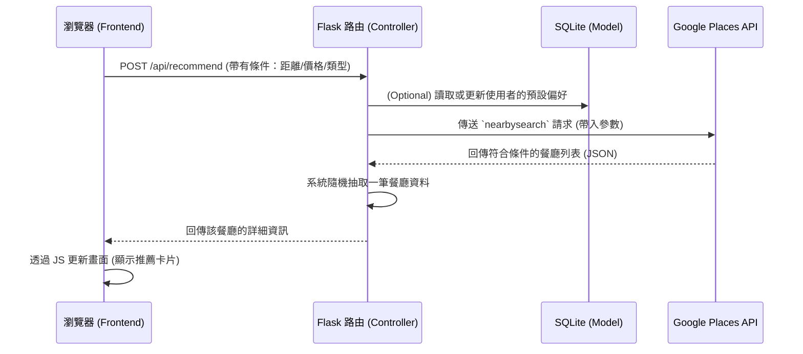

# 條件篩選功能 - 系統架構與介面設計

## 1. 資料庫結構與 API 參數對應
考量到專案採用 SQLite 搭配 Google Places API，資料架構規劃為「本地儲存偏好」與「即時 API 查詢」雙軌並行：

### SQLite 本地資料表 (UserPreferences)
負責儲存使用者的預設篩選條件，讓系統更貼心，減少每次都要重新選擇的摩擦力。
- `id` (INTEGER, Primary Key): 偏好設定流水號
- `session_id` (TEXT): 匿名使用者的 Session ID（因目前無會員系統，採用 Session 辨識）
- `default_radius` (INTEGER): 預設搜尋半徑（公尺，如 1000, 3000, 5000）
- `default_min_price` (INTEGER): 最低價格等級（0-4）
- `default_max_price` (INTEGER): 最高價格等級（0-4）
- `favorite_cuisines` (TEXT): 偏好的料理類型（JSON 陣列字串，如 `["日式", "火鍋"]`）

### Google Places API 參數映射
當使用者在前端選擇條件後，傳遞給後端 Flask，後端會將其轉換為 Google Places API 的參數：
- **距離 (Distance)** ➡️ `location` (用戶經緯度) + `radius` (搜索半徑)
- **價格 (Price)** ➡️ `minprice` 與 `maxprice` (0=免費, 1=便宜, 2=適中, 3=昂貴, 4=非常昂貴)
- **料理類型 (Cuisine)** ➡️ `keyword` 參數 (例如傳入 "拉麵", "咖啡廳")

---

## 2. UI/UX 流程 (Flowchart)

```mermaid
graph TD
    A[首頁/主畫面] -->|點擊篩選按鈕| B(開啟條件篩選 Modal)
    B --> C{選擇篩選條件}
    C -->|距離滑桿| D[設定距離範圍 <br>例如 1km, 3km, 5km]
    C -->|價格按鈕| E[選擇價格區間 <br>$, $$, $$$]
    C -->|類別標籤| F[點選料理類型 <br>台式, 日式, 早午餐...]
    D --> G[點擊「套用並隨機抽選」]
    E --> G
    F --> G
    G --> H[載入動畫 - <3秒內]
    H --> I[跳轉並顯示隨機推薦餐廳結果]
    I -->|不滿意| G
```

---

## 3. 系統元件架構與資料流 (Sequence Diagram)



---

## 4. UI Mockup 預覽圖
這張 Mockup 呈現了篩選介面的質感，採用 Modern Glassmorphism 風格，按鈕清晰、直覺，且符合「10秒內完成選擇」的易用性需求。


