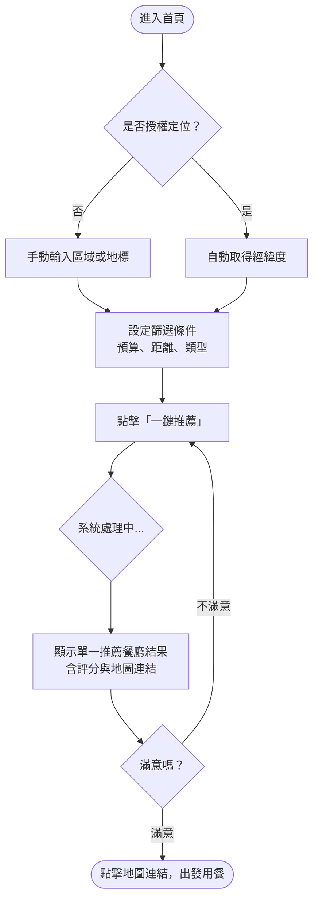
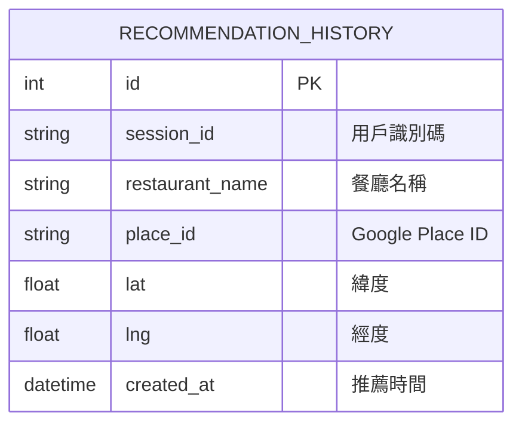

# 附近餐廳推薦 - 系統架構與介面設計

這份文件專注於「系統可取得使用者目前位置，並推薦附近餐廳」這項核心功能的架構與介面規劃。

## 1. 系統架構與元件關係 (Architecture)

### 元件架構圖
使用 Flask MVC 架構，透過前端 JavaScript 取得裝置 GPS 位置，再將經緯度發送給後端，由後端呼叫 Google Places API 進行搜尋與推薦。

```mermaid
graph LR
    A[使用者瀏覽器] -->|1. 點擊定位/授權GPS| B(前端 HTML/JS)
    B -->|2. GET /recommend?lat=...&lng=...| C[Flask Route (Controller)]
    C -->|3. 查詢歷史紀錄| D[(SQLite Database)]
    C -->|4. 呼叫外部服務| E[Google Places API]
    E -->|5. 回傳餐廳清單| C
    D -->|回傳資料| C
    C -->|6. 隨機演算法挑選| C
    C -->|7. 渲染 Jinja2| B
    B -->|8. 顯示推薦結果| A
```

## 2. UI/UX 流程設計 (Flowchart)

### 使用者操作流程 (User Flow)


## 3. 資料庫結構規劃 (DB Design)

針對本功能，主要需要記錄使用者的「探險歷史」（曾經抽中過哪些餐廳），一方面能作為個人回顧，另一方面也可讓隨機演算法避免短期內重複推薦同一家餐廳。

### ER 圖


### 資料表說明
- **`recommendation_history`**（推薦歷史紀錄表）
    - `id`: `INTEGER PRIMARY KEY AUTOINCREMENT`
    - `session_id`: `TEXT` (未強制登入時，可透過 Cookie 紀錄 Session ID 來辨識使用者)
    - `restaurant_name`: `TEXT` (餐廳名稱，直接存文字方便快速顯示)
    - `place_id`: `TEXT` (對應 Google Places API 的唯一識別碼，需要地圖連結時可直接帶入)
    - `lat` / `lng`: `REAL` (餐廳經緯度)
    - `created_at`: `DATETIME DEFAULT CURRENT_TIMESTAMP` (紀錄推薦產生的時間)

## 4. Mockup 介面預覽圖

以下為「附近餐廳推薦」的 UI 概念設計。採用現代感 Glassmorphism（毛玻璃）風格，主畫面清晰展示「定位地圖」、「條件滑桿（預算、距離）」以及醒目的「Recommend Nearby Food」一鍵推薦按鈕。


