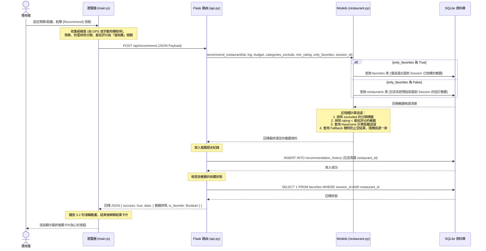
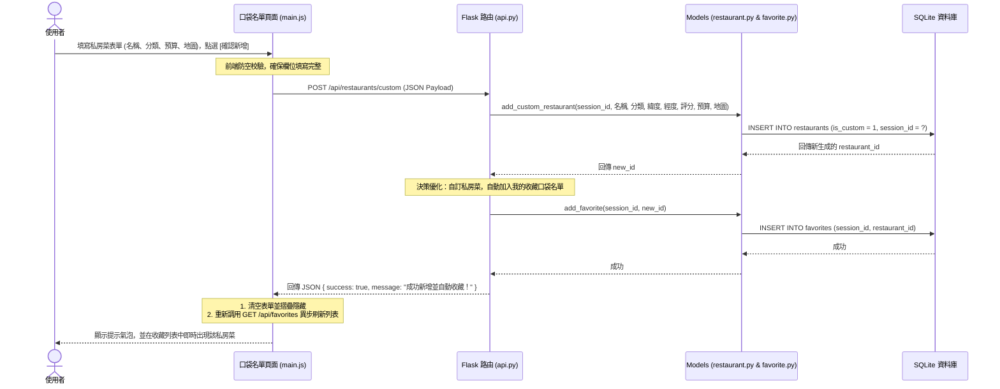

# 隨便吃什麼都好系統 - 流程圖與資料流設計文件 (FLOWCHART.md)

本文件專注於視覺化描述「隨便吃什麼都好」系統的**使用者操作流程 (User Flow)**、**系統序列圖 (Sequence Diagram)** 以及**功能路由 API 對照表**，幫助開發與測試小組清晰地理解使用者的操作路徑與系統內部的資料流動。

---

## 1. 使用者流程圖 (User Flow)

本系統採用質感 App 的單頁籤架構。使用者進入系統後，可以自由在底部三個 Tab（探索、口袋名單、探險日誌）進行切換，執行不同的核心操作。以下是完整的使用者操作路徑圖：

```mermaid
flowchart TD
    A([開啟網頁進入系統]) --> B[首頁 - 預設為「探索」分頁]
    
    %% Tab 切換控制
    B --> C{選擇底部導覽分頁？}
    
    %% =============== EXPLORE TAB ===============
    C -->|探索 (Explore)| D[目前定位卡片]
    D --> D1{獲取位置方式？}
    D1 -->|GPS 定位| D2[點擊定位按鈕/取得經緯度]
    D1 -->|手動地標| D3[手動選擇區域/地標下拉選單]
    D2 --> DP[設定基本篩選: 預算、距離]
    D3 --> DP
    DP --> E{需要進階篩選？}
    E -->|是| F[展開「進階防雷篩選」面版<br>1. 最低星等限制<br>2. 飲食避雷排除標籤<br>3. 僅從口袋名單中抽取]
    E -->|否| G[點選 Recommend 一鍵抽籤]
    F --> G
    G --> H[播放 Slot Machine 滾輪動畫]
    H --> I[顯示單一推薦餐廳卡片結果]
    I --> J{要進行什麼動作？}
    J -->|覺得不錯，開啟導航| K[點擊 Google Maps 按鈕，開啟外部地圖]
    J -->|想要收藏，點擊心形| L[心跳動畫，即時加入或移出口袋名單]
    J -->|不滿意想重抽| G
    
    %% =============== FAVORITES TAB ===============
    C -->|口袋名單 (Favorites)| M[檢視個人已收藏餐廳清單]
    M --> N{要進行什麼操作？}
    N -->|一鍵開啟地圖導航| K
    N -->|點選垃圾桶| O[確認視窗，將該餐廳移出口袋名單]
    N -->|點選新增私房菜| P[展開毛玻璃自訂餐廳表單]
    P --> Q[輸入餐廳名稱、分類標籤、預算與地圖]
    Q --> R[點擊確認送出]
    R --> S[寫入資料庫並自動加入收藏]
    S --> M
    
    %% =============== JOURNAL/HISTORY TAB ===============
    C -->|探險日誌 (Journal)| T[檢視推薦歷史紀錄清單<br>依時間由新到舊排列]
    T --> U{要進行什麼動作？}
    U -->|點選星星圖示| V[即時儲存 1-5 星級評分]
    U -->|輸入文字心得| W[填寫心得短評，並點擊儲存按鈕]
    U -->|點選地圖導航| K
    U -->|點選垃圾桶圖示| X[點擊確認，將該筆推薦紀錄從日誌中移除]
```

---

## 2. 系統序列圖 (Sequence Diagram)

為了解釋前端與後端 Model、資料庫之間的動態協作，以下展示兩個核心功能的系統資料流向圖：

### A. 「一鍵抽籤推薦」系統序列圖
當使用者在前端設定防雷條件並點選抽籤按鈕時，資料的傳遞與處理順序如下：



### B. 「新增自訂私房餐廳」系統序列圖
當使用者新增個人私房餐廳時，系統自動將其註冊並寫入收藏名單的流向如下：



---

## 3. 功能路由 API 對照表

本專案採用非同步 RESTful 設計。以下是系統中所有的路由（含網頁路由與 API 路由）及其對應的 HTTP 方法與功能說明的完整對照表：

| 路由路徑 (URL Route) | HTTP 方法 | 負責控制器 (Blueprint) | 功能說明 |
| --- | --- | --- | --- |
| `/` | `GET` | `main_bp` (`main.py`) | **主網頁入口**：渲染渲染基礎的 `index.html` 外殼。 |
| `/api/recommend` | `POST` | `api_bp` (`api.py`) | **一鍵抽籤推薦 API**：依經緯度、距離、預算與防雷條件過濾，隨機抽取餐廳，寫入推薦歷史，並回傳收藏狀態。 |
| `/api/categories` | `GET` | `api_bp` (`api.py`) | **動態分類查詢 API**：返回目前資料庫中所有現存不重複的餐廳種類標籤，供前端渲染防雷多選標籤。 |
| `/api/favorites` | `GET` | `api_bp` (`api.py`) | **查詢口袋名單 API**：獲取該 Session 收藏的所有餐廳詳情清單。 |
| `/api/favorites/toggle` | `POST` | `api_bp` (`api.py`) | **收藏切換 API**：接收 `restaurant_id`，自動執行加入/取消收藏，並回傳最新收藏狀態。 |
| `/api/restaurants/custom` | `POST` | `api_bp` (`api.py`) | **新增自訂私房菜 API**：接收私房菜資訊，寫入資料庫並自動進行收藏。 |
| `/api/history` | `GET` | `api_bp` (`api.py`) | **歷史探險紀錄 API**：獲取該 Session 所有的推薦歷史紀錄（按時間倒序）。 |
| `/api/history/<id>/feedback` | `POST` | `api_bp` (`api.py`) | **更新評分與心得 API**：接收 1-5 星星評分與文字心得，更新特定歷史紀錄。 |
| `/api/history/<id>` | `DELETE` | `api_bp` (`api.py`) | **刪除歷史紀錄 API**：將特定的推薦歷史紀錄從日誌中移除。 |
