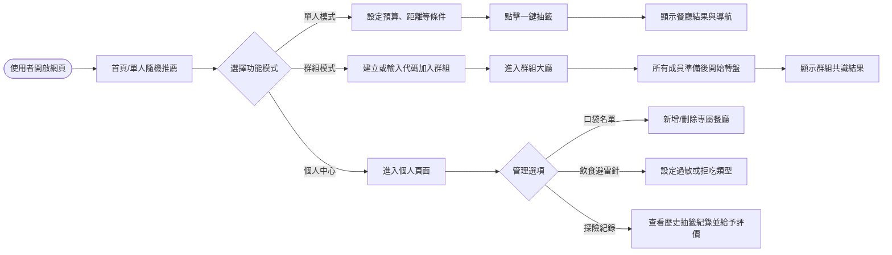
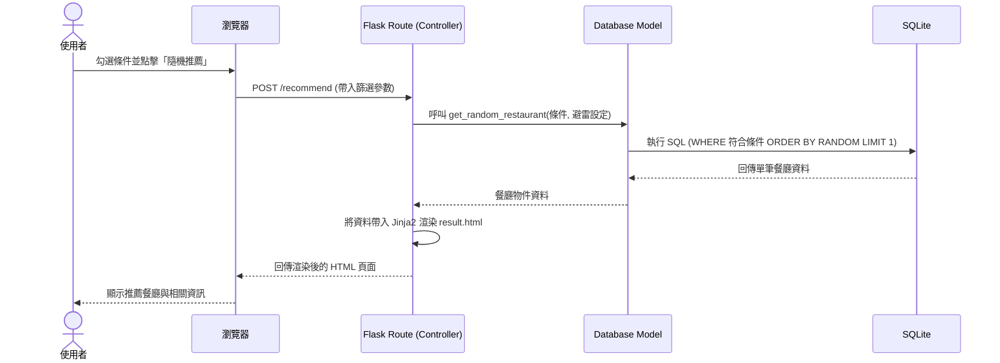

# 隨便吃什麼都好系統 - 流程圖文件 (Flowchart)

本文件根據 PRD 需求與系統架構設計，視覺化呈現使用者的操作路徑以及系統內部的資料流動。

## 1. 使用者流程圖 (User Flow)

此流程圖描述了使用者進入平台後，如何操作單人推薦、群組決策模式，以及管理個人設定（口袋名單、避雷針與歷史紀錄）。

## 2. 系統序列圖 (Sequence Diagram)

以下以「單人隨機推薦 (一鍵抽籤)」為例，展示從使用者點擊按鈕到看見結果的系統內部運作流程。

## 3. 功能清單對照表

本表格將 PRD 中規劃的功能對應至預計實作的 URL 路徑與 HTTP 方法，供後續開發 Route 參考。

| 功能名稱 | URL 路徑 | HTTP 方法 | 說明 |
| :--- | :--- | :--- | :--- |
| **首頁 / 單人條件設定** | `/` | GET | 顯示首頁表單，讓使用者輸入單人抽籤的條件 |
| **執行單人推薦** | `/recommend` | POST | 接收首頁表單條件，進行隨機抽取並顯示結果頁面 |
| **建立群組決策** | `/group/create` | POST | 產生一個新的群組房間，並回傳邀請連結/代碼 |
| **群組大廳** | `/group/<room_id>` | GET | 顯示群組內的成員狀態與轉盤介面 |
| **群組執行抽取** | `/group/<room_id>/spin`| POST | 執行群組共識的隨機抽取，並更新群組結果 |
| **個人設定頁面** | `/profile` | GET | 顯示口袋名單、避雷針與歷史紀錄的入口 |
| **新增/編輯口袋名單** | `/profile/restaurants` | POST | 將新的餐廳加入使用者的專屬名單 |
| **更新飲食避雷針** | `/profile/blacklist` | POST | 更新使用者不想吃的分類或過敏源設定 |
| **新增歷史評價** | `/history/rate` | POST | 針對過去抽到的餐廳填寫簡單評價與分數 |
