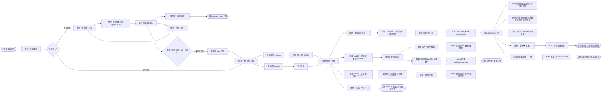
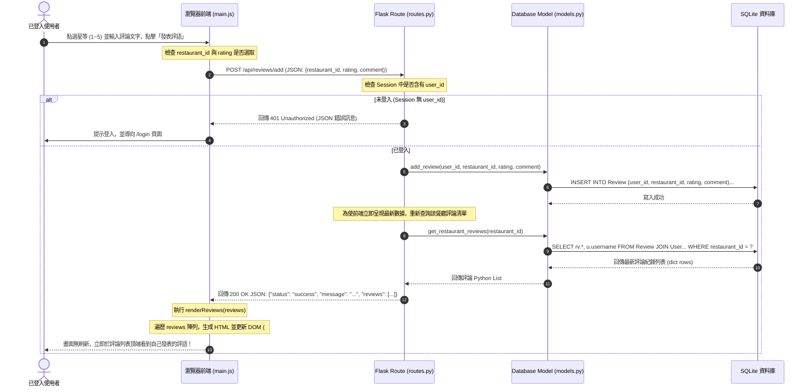
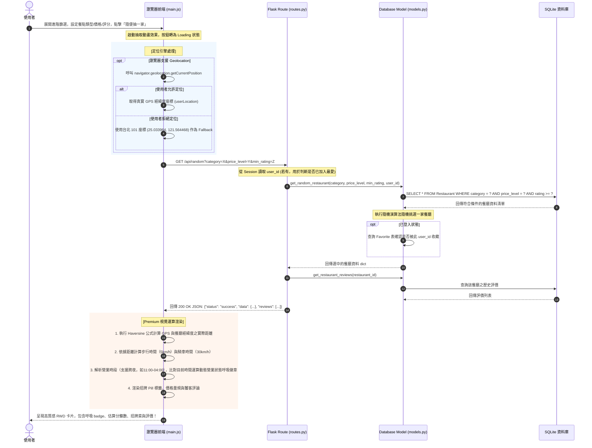

# 系統與使用者流程圖設計說明書 (FLOWCHART.md)

本文件依據 [產品需求文件 (PRD.md)](file:///c:/Users/AmyLin/OneDrive/桌面/very-good-1/docs/PRD.md) 與 [系統架構設計說明書 (ARCHITECTURE.md)](file:///c:/Users/AmyLin/OneDrive/桌面/very-good-1/docs/ARCHITECTURE.md) 的規格，規劃並視覺化「隨機推薦系統 - 隨便吃什麼都好」的**使用者操作流程 (User Flow)**、**系統非同步交互序列圖 (Sequence Diagram)**，以及**系統功能路由對照表**。

---

## 1. 使用者流程圖 (User Flow)

此流程圖描述使用者從進入系統首頁開始，進行免登入抽取、帳號註冊登入、我的最愛管理、評論寫入與刪除、專屬最愛抽取，以及 GPS 定位引導的完整操作路徑。

---

## 2. 系統序列圖 (Sequence Diagram)

為優化使用者體驗，系統大量採用混合式渲染（Hybrid Rendering），小互動均以非同步 AJAX (Fetch API) 進行。以下詳細呈現兩個核心流程的底層互動順序。

### 2.1 登入用戶新增評論與即時渲染流程 (AJAX Add Review Flow)

此流程描述已登入使用者在推薦卡片下方撰寫評論、評分，並點擊送出時，資料如何在瀏覽器、Flask 後端與 SQLite 資料庫之間流動，並完成無刷新前端更新。

---

### 2.2 條件篩選隨機推薦與 GPS/時間運算流程 (AJAX Recommendation & Premium Display)

此流程描述使用者設定篩選條件點擊抽取後，系統透過 API 獲取隨機餐廳，並由前端 JS 結合 GPS 計算精準距離與動態營業狀態的完整互動。

---

## 3. 功能清單與路由對照表 (Routing Table)

以下為本專案完整的 Controller 路由清單，包含前端視圖渲染路由與非同步 AJAX API 端點對照。

| 功能名稱 | 路由路徑 (URL) | HTTP 方法 | 回傳格式 | 參數說明 | 權限要求 |
| :--- | :--- | :--- | :--- | :--- | :--- |
| **首頁** | `/` | `GET` | HTML (Jinja2) | 無 | 訪客 / 會員 |
| **會員註冊** | `/register` | `GET`, `POST` | HTML / Redirect | `POST` 表單: `username`, `password`, `confirm_password` | 訪客 |
| **會員登入** | `/login` | `GET`, `POST` | HTML / Redirect | `POST` 表單: `username`, `password` | 訪客 |
| **會員登出** | `/logout` | `GET` | Redirect | 無 | 會員 |
| **進階篩選隨機推薦 API** | `/api/random` | `GET` | JSON | Query 參數 (選填): `category`, `price_level`, `min_rating` | 訪客 / 會員 |
| **我的最愛專頁** | `/favorites` | `GET` | HTML (Jinja2) | 無 | 會員 (未登入重導向) |
| **切換最愛收藏 API** | `/api/favorites/toggle` | `POST` | JSON | `POST` JSON: `restaurant_id` | 會員 (未登入 401) |
| **最愛限定抽取 API** | `/api/favorites/draw` | `GET` | JSON | 無 | 會員 (未登入 401) |
| **我的評價專頁** | `/reviews` | `GET` | HTML (Jinja2) | 無 | 會員 (未登入重導向) |
| **發布評論 API** | `/api/reviews/add` | `POST` | JSON | `POST` JSON: `restaurant_id`, `rating` (1-5), `comment` | 會員 (未登入 401) |
| **刪除評論 API** | `/api/reviews/delete/<review_id>` | `POST`, `DELETE` | JSON | 路由參數: `review_id` | 會員 (未登入 401 / 限作者) |

---

## 4. 關鍵流程節點說明 (UX Touchpoints)

1. **認證邊界處理**：
   - 訪客可以無障礙使用「首頁隨便抽一家」與「進階篩選」。
   - 當訪客意圖點擊推薦結果卡片左上角的「愛心」進行收藏，或意圖在卡片下方填寫評論時，系統會以精美的前端 Alert 提示，並引導至登入畫面，保留原操作意圖。
2. **無刷新（AJAX）交互**：
   - 點擊「愛心」收藏時，愛心瞬間變紅並產生放大動畫，後端靜默更新資料庫。
   - 在「我的收藏」或「我的評價」點擊移除/刪除時，前端會彈出確認視窗，確認後該卡片會套用 `.fade-out` CSS 動畫淡出，並在 400ms 後從 DOM 移除，其餘卡片自動流暢重排，避免傳統整頁刷新帶來的卡頓感。
3. **定位權限失敗容錯**：
   - 定位模組在載入首頁時即於背景非同步請求權限。若使用者點選「拒絕」，系統將座標無縫設定在「台北 101」，並顯示「示範距離」灰色微章，此設計既不影響核心推薦功能，又能在視覺上維持精美的欄位排版。
