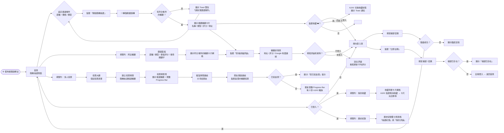
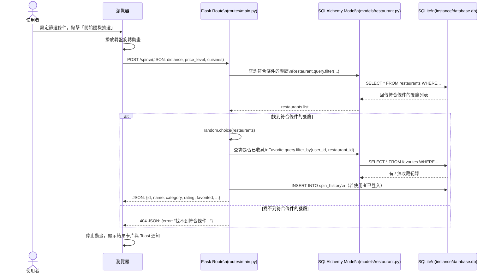
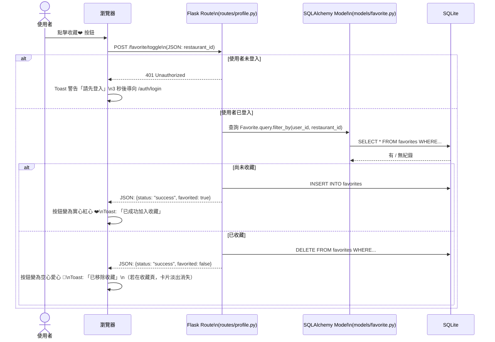
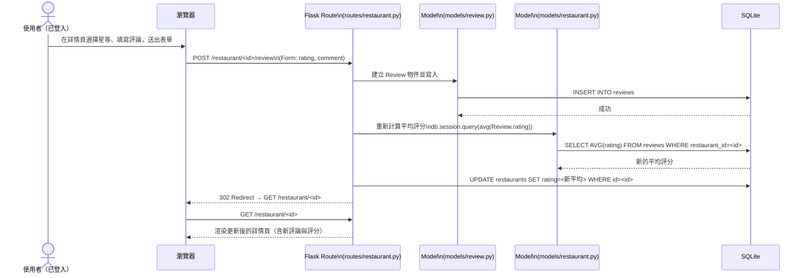
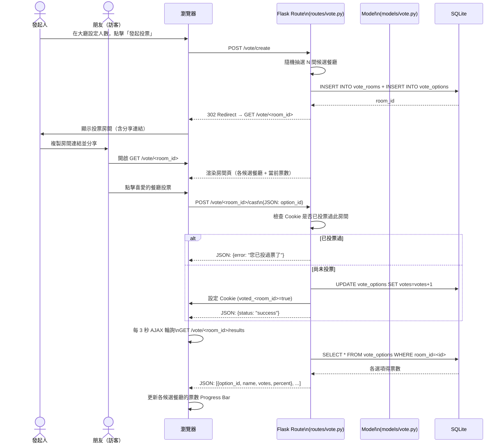

# 隨便吃什麼都好 — 流程圖設計文件 (FLOWCHART.md)

> 本文件依據 `docs/PRD.md` 的功能需求與 `docs/ARCHITECTURE.md` 的系統架構，以 Mermaid 語法呈現使用者操作路徑與系統內部資料流，適合放入報告或簡報中使用。

---

## 1. 使用者流程圖（User Flow）

描述使用者從進入網站到完成各主要功能的完整操作路徑。

---

## 2. 系統序列圖（Sequence Diagrams）

以下為各主要功能的後端資料流序列圖，描述從使用者操作到資料庫完成的完整步驟。

### 2.1 隨機抽選（/spin）

### 2.2 收藏切換（AJAX /favorite/toggle）

### 2.3 提交評論與評分

### 2.4 多人投票（建立房間與投票）

---

## 3. 功能清單對照表

| 功能名稱 | URL 路徑 | HTTP 方法 | 登入要求 | 說明 |
|---|---|---|---|---|
| 首頁（抽選頁） | `/` | GET | 否 | 渲染首頁，載入所有餐廳類別供篩選 |
| 隨機抽選 | `/spin` | POST | 否（登入才記錄歷史） | 依條件隨機抽選餐廳，回傳 JSON |
| 附近餐廳探索 | `/nearby` | GET | 否 | 條件篩選餐廳列表（距離/類型/評分/關鍵字） |
| 餐廳詳情頁 | `/restaurant/<id>` | GET | 否 | 顯示餐廳資訊、評分與所有評論 |
| 提交餐廳評論 | `/restaurant/<id>/review` | POST | **是** | 提交評論並自動重算平均評分 |
| 會員登入 | `/auth/login` | GET / POST | 否 | 顯示表單（GET）/ 驗證登入（POST） |
| 會員註冊 | `/auth/register` | GET / POST | 否 | 顯示表單（GET）/ 建立帳號（POST） |
| 登出 | `/auth/logout` | POST | **是** | 清除 Flask-Login Session |
| 我的收藏 | `/profile/favorites` | GET | **是** | 顯示使用者收藏的餐廳卡片網格 |
| 收藏切換（AJAX） | `/favorite/toggle` | POST | **是** | 新增或取消收藏，回傳 JSON |
| 歷史紀錄 | `/profile/history` | GET | **是** | 顯示抽選紀錄與評論歷程雙分頁 |
| 投票大廳 | `/vote` | GET | 否 | 顯示發起投票表單 |
| 建立投票房間 | `/vote/create` | POST | 否 | 隨機選出候選餐廳，建立投票房間 |
| 投票房間 | `/vote/<room_id>` | GET | 否 | 顯示候選餐廳與即時票數 |
| 送出投票 | `/vote/<room_id>/cast` | POST | 否（Cookie 防灌票） | 為指定選項加票，回傳 JSON |
| 查詢即時票數 | `/vote/<room_id>/results` | GET | 否 | 回傳各選項票數 JSON（每 3 秒輪詢） |
