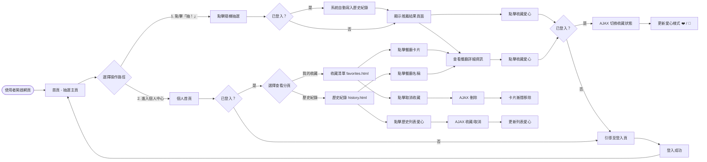
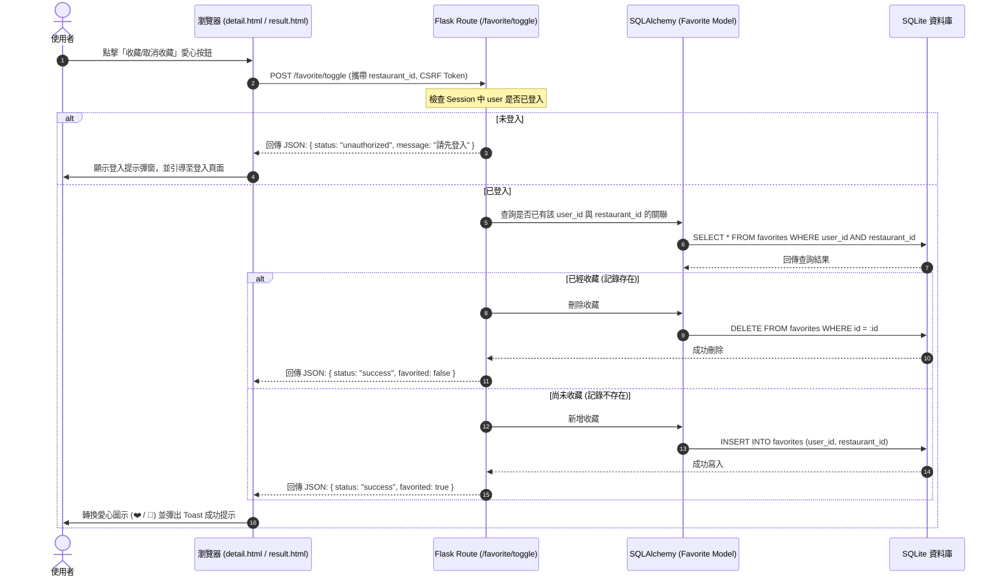
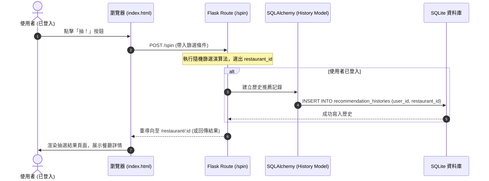

# 流程圖文件（Feature Flowchart）- F-05 收藏與歷史紀錄

**專案名稱：** 隨便吃什麼都好（Let's Just Eat）  
**功能模組：** F-05 收藏與歷史紀錄 (Favorites & Recommendation History)  
**對應主流程：** [docs/FLOWCHART.md](file:///c:/Users/USER/very-good/docs/FLOWCHART.md) (若有)  
**狀態：** 草稿  
**撰寫日期：** 2026-05-20  

---

## 1. 使用者流程圖（User Flow）
下圖描述使用者從進入首頁開始，進行隨機推薦（進而產生歷史紀錄與收藏操作），以及進入個人中心管理收藏清單與歷史紀錄的操作路徑。

---

## 2. 系統序列圖（Sequence Diagram）

### 2.1 收藏/取消收藏 (AJAX Toggle Flow)
此序列圖詳細描述使用者點擊收藏按鈕後，瀏覽器、Flask 後端與 SQLite 資料庫之間的非同步資料互動。

### 2.2 隨機推薦並自動記錄歷史
當登入使用者點擊「抽！」時，系統如何將抽選結果與推薦歷史寫入資料庫：

---

## 3. 功能清單對照表

本功能的路由配置與權限管理如下：

| 功能名稱 | URL 路徑 | HTTP 方法 | 登入防護 | 描述 |
| :--- | :--- | :--- | :--- | :--- |
| **隨機推薦** | `/spin` | `POST` | 否 | 提交篩選條件進行抽選。若使用者已登入，則自動寫入歷史紀錄。 |
| **收藏狀態切換** | `/favorite/toggle` | `POST` | 是 | 透過 AJAX POST 請求切換收藏/取消收藏狀態，避免網頁重載。 |
| **我的收藏清單** | `/profile/favorites` | `GET` | 是 | 進入個人中心，載入並渲染已收藏餐廳（Jinja2 渲染 `favorites.html`）。 |
| **歷史推薦紀錄** | `/profile/history` | `GET` | 是 | 進入個人中心，載入並渲染歷史推薦清單（Jinja2 渲染 `history.html`）。 |
