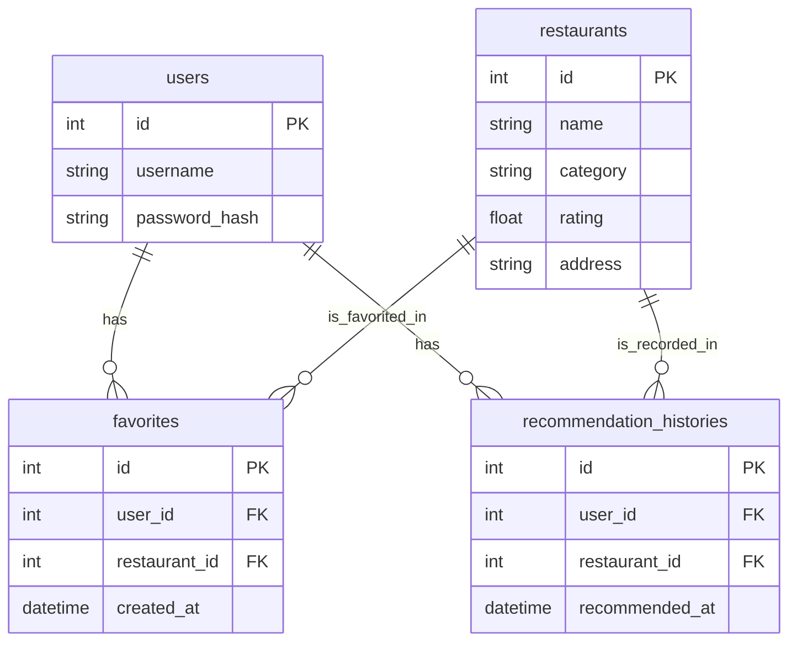

# 產品需求文件（Feature PRD）- F-05 收藏與歷史紀錄

**專案名稱：** 隨便吃什麼都好（Let's Just Eat）  
**功能模組：** F-05 收藏與歷史紀錄 (Favorites & Recommendation History)  
**對應主 PRD：** [docs/PRD.md](file:///c:/Users/USER/very-good/docs/PRD.md) 功能五  
**狀態：** 草稿  
**撰寫日期：** 2026-05-20  

---

## 1. 功能概述

### 1.1 背景與動機
「隨便吃什麼都好」隨機美食推薦平台的核心功能是透過隨機抽選機制降低使用者的「決策成本」。然而，單純的單次抽選無法滿足使用者的長期需求。使用者在抽到心儀的餐廳時，通常希望能**儲存**該餐廳以便未來快速存取；此外，系統也應**自動記錄**每一次抽選結果，方便使用者回溯最近吃過或推薦過的餐廳，避免在短期內重複抽選到相同的店家。

本功能（F-05 收藏與歷史紀錄）旨在透過持久化儲存使用者喜愛的餐廳與抽選歷史，提升用戶的黏著度與平台實用性，打造一個具備個人化記憶的推薦系統。

### 1.2 目標用戶
1. **重度決策障礙者**：希望查看過去推薦過的餐廳，藉此確認近期用餐軌跡，避免重複。
2. **美食口袋名單收集者**：抽到有興趣或評價高的餐廳時，希望一鍵儲存，作為日後的備用選擇。
3. **日常高頻使用者**：希望擁有一個集中的個人頁面，同時管理「收藏餐廳」與「歷史推薦紀錄」。

### 1.3 核心價值主張
* **零記憶負擔**：系統自動在背景記錄每一次隨機推薦，使用者無需手動保存。
* **口袋名單隨身帶**：快速收藏與取消收藏，輕鬆管理個人最愛餐廳。
* **無縫銜接體驗**：從收藏與歷史紀錄中可直接點擊進入餐廳詳細資訊頁面。

---

## 2. 功能需求與使用者故事

### 2.1 餐廳收藏功能 (Favorites)

#### 【需求 1】將餐廳加入收藏
* **功能描述**：登入後的使用者在「隨機推薦結果頁面」或「餐廳詳細資訊頁面」上，可以點擊「收藏」按鈕，將該餐廳儲存至其個人收藏清單中。
* **使用者故事**：
  * 作為一名**美食口袋名單收集者**，我希望在抽到一間看起來很好吃的餐廳時**能立刻點擊收藏**，以便我**在之後的週末聚餐時能快速找到這家店**。
* **驗收標準**：
  * 使用者必須處於登入狀態。若未登入，點擊收藏按鈕應彈出提示並引導至登入頁面。
  - 使用 AJAX (Fetch API) 進行非同步請求，點擊後按鈕狀態應立即轉化為「已收藏」（例如空心愛心變實心紅心），頁面無需重新整理。
  - 成功加入後，資料庫的 `favorites` 資料表應新增一筆關聯紀錄。

#### 【需求 2】取消收藏餐廳
- **功能描述**：使用者可在「餐廳詳細資訊頁面」、「隨機推薦結果頁面」或「個人收藏清單頁面」上，點擊「取消收藏」按鈕移除該餐廳。
* **使用者故事**：
  - 作為一名**一般使用者**，我希望**能輕易地將不再感興趣的餐廳從收藏中移除**，以便**我的收藏清單只保留我真正想去的餐廳**。
* **驗收標準**：
  - 點擊後，UI 應立即恢復為「加入收藏」狀態，資料庫中對應的收藏記錄需被刪除。
  - 在「個人收藏清單」中點擊取消收藏後，該餐廳卡片應從畫面上以漸隱動畫消失，提升操作流暢感。

#### 【需求 3】查看我的收藏清單
- **功能描述**：提供一個專屬的「我的收藏」頁面，展示目前登入使用者所有收藏的餐廳。
* **使用者故事**：
  - 作為一名**重度決策障礙者**，我希望**在不使用隨機抽選時，能直接瀏覽我收藏的餐廳**，以便**我可以快速從我的口袋名單中挑選一間去吃**。
* **驗收標準**：
  - 頁面應採用 Bootstrap 5 Card 佈局，展示餐廳基本資訊：餐廳名稱、類型、評分、封面圖。
  - 點擊卡片可跳轉至餐廳詳細資訊頁。
  - 卡片上需包含「取消收藏」的快速按鈕。
  - 若無任何收藏，應顯示精美的 Bootstrap 空白狀態提示（Empty State）。

---

### 2.2 歷史推薦紀錄 (History)

#### 【需求 1】自動記錄推薦事件
- **功能描述**：當登入的使用者進行「隨機抽選餐廳」並產生結果時，系統必須在背景自動將該次推薦事件寫入資料庫。
* **使用者故事**：
  - 作為一名**一般使用者**，我希望**系統能自動幫我記住每一次抽到的餐廳**，以便**我不需要手動截圖或記錄，隨時都能回查**。
* **驗收標準**：
  - 只有**已登入使用者**的隨機抽選才會被記錄到歷史紀錄表中（未登入用戶僅顯示推薦結果，不寫入資料庫）。
  - 每次成功推薦，必須記錄：使用者 ID、餐廳 ID、以及推薦當下的時間戳記（Timestamp）。

#### 【需求 2】查看歷史推薦紀錄列表
- **功能描述**：使用者可在個人中心查看歷史推薦紀錄，以列表形式呈現。
* **使用者故事**：
  - 作為一名**日常高頻使用者**，我希望**能查看我的歷史推薦紀錄**，以便**我知道自己昨天、前天都抽到了什麼餐廳**。
* **驗收標準**：
  - 歷史紀錄列表必須包含以下資訊：
    1. **餐廳名稱** (Restaurant Name)
    2. **推薦時間** (Recommended At - 顯示格式：`YYYY-MM-DD HH:MM`)
    3. **餐廳類型** (Category / Cuisine Type - 例如：日式拉麵、美式漢堡)
    4. **評分** (Rating - 餐廳 1~5 星評分)
  - 列表預設以「推薦時間」進行降序排列（最新推薦的在最上方）。
  - 列表應包含「查看詳情」的連結，以及一個「加入收藏/取消收藏」的快速捷徑按鈕。

---

## 3. 技術規格與架構設計

### 3.1 技術限制與元件職責

本功能遵循 [docs/ARCHITECTURE.md](file:///c:/Users/USER/very-good/docs/ARCHITECTURE.md) 的架構設計，開發規範如下：

* **後端**：Flask + SQLAlchemy ORM。使用 Flask-Login 的 `@login_required` 裝飾器保護相關路由。
* **前端**：HTML5 + Jinja2 模板 + Bootstrap 5 (Styling) + Vanilla JS (AJAX 互動)。
* **資料庫**：SQLite。

#### 元件職責對照：
```
┌───────────────────────────────────────────────────────────────────────────┐
│                          F-05 元件職責表                                   │
├─────────────┬─────────────────────────────────────────────────────────────┤
│ Model       │ app/models/favorite.py (收藏表關聯)                         │
│             │ app/models/history.py (歷史推薦紀錄表)                       │
├─────────────┼─────────────────────────────────────────────────────────────┤
│ Controller  │ app/routes/profile.py (處理 /profile/favorites 與 /history)  │
│             │ app/routes/main.py (在 /spin 隨機抽選路由中觸發歷史寫入)      │
├─────────────┼─────────────────────────────────────────────────────────────┤
│ View        │ app/templates/profile/favorites.html (收藏頁面)              │
│             │ app/templates/profile/history.html (歷史紀錄頁面)            │
└─────────────┴─────────────────────────────────────────────────────────────┘
```

### 3.2 資料庫 Schema 設計 (SQLite)

為了儲存收藏與歷史紀錄，資料庫將建立以下兩個資料表，並透過外鍵關聯至使用者與餐廳資料表。



#### 1. `favorites` 資料表
| 欄位名稱 | 資料類型 | 約束條件 | 描述 |
| :--- | :--- | :--- | :--- |
| `id` | INTEGER | PRIMARY KEY, AUTOINCREMENT | 唯一識別碼 |
| `user_id` | INTEGER | FOREIGN KEY REFERENCES `users(id)`, NOT NULL | 收藏的使用者 ID |
| `restaurant_id` | INTEGER | FOREIGN KEY REFERENCES `restaurants(id)`, NOT NULL | 收藏的餐廳 ID |
| `created_at` | TIMESTAMP | DEFAULT CURRENT_TIMESTAMP, NOT NULL | 收藏時間 |

*索引設計：針對 `(user_id, restaurant_id)` 建立聯合唯一索引 (Unique Index)，防止重複收藏。*

#### 2. `recommendation_histories` 資料表
| 欄位名稱 | 資料類型 | 約束條件 | 描述 |
| :--- | :--- | :--- | :--- |
| `id` | INTEGER | PRIMARY KEY, AUTOINCREMENT | 唯一識別碼 |
| `user_id` | INTEGER | FOREIGN KEY REFERENCES `users(id)`, NOT NULL | 被推薦的使用者 ID |
| `restaurant_id` | INTEGER | FOREIGN KEY REFERENCES `restaurants(id)`, NOT NULL | 被推薦的餐廳 ID |
| `recommended_at` | TIMESTAMP | DEFAULT CURRENT_TIMESTAMP, NOT NULL | 推薦時間 |

*索引設計：針對 `user_id` 建立索引，以加速載入該使用者的歷史推薦列表。*

---

## 4. 非功能需求

### 4.1 效能與使用者體驗 (UX)
* **無感延遲**：AJAX 收藏/取消收藏之 API 回應時間應控制在 **150ms** 以內，且 UI 狀態轉換應平滑。
* **分頁處理**：當使用者的歷史推薦紀錄超過 30 筆時，應採用分頁機制（Pagination），預設每頁顯示 10 筆，降低單次查詢 SQLite 的載入延遲。
* **行動端適配**：歷史紀錄表格在手機等窄螢幕裝置上，應使用 Bootstrap 的 `.table-responsive` 容器，以防破版。

### 4.2 安全性與資料隔離
* **水平越權防範**：使用者僅能查詢與操作**屬於自己 `user_id`** 的收藏與歷史紀錄。後端 Controller 必須嚴格驗證 Session 中的 `current_user.id`。
* **防 SQL 注入**：所有資料庫操作需經由 SQLAlchemy ORM 參數化執行，不使用拼接 SQL 字串。
* **防跨站請求偽造 (CSRF)**：對於所有修改資料庫狀態的 POST 請求（如 AJAX 收藏與取消收藏），前端必須在標頭中攜帶 CSRF Token。

---

## 5. MVP 開發範圍 (F-05)

| 優先權等級 | 功能項目 | 開發描述 | 狀態 |
| :--- | :--- | :--- | :--- |
| **Must Have**  | 1. 收藏/取消收藏核心 API 與按鈕 | 實作 `/favorite/toggle` 路由，並在餐廳詳細頁面渲染愛心按鈕。 | 未開始 |
| (關鍵核心)     | 2. 收藏清單頁面 (`favorites.html`) | 登入後於個人中心展示所有收藏，並能點擊跳轉至詳情頁。 | 未開始 |
|                | 3. 自動寫入歷史紀錄 | 在 `POST /spin` 抽選成功後，自動於 `recommendation_histories` 寫入紀錄。| 未開始 |
|                | 4. 歷史紀錄列表頁面 (`history.html`)| 顯示餐廳名稱、類型、評分與推薦時間。 | 未開始 |
| **Should Have**| 1. AJAX 收藏無痛切換 | 透過 JS Fetch API 實作非同步收藏，避免整頁重新整理，搭配 Bootstrap Toast 提示。| 未開始 |
| (優化體驗)     | 2. 歷史紀錄中直接收藏 | 在歷史紀錄列表中，針對未收藏餐廳直接點擊愛心加入收藏。 | 未開始 |
| **Nice to Have**| 1. 清空歷史紀錄 | 提供「清空歷史紀錄」按鈕，允許使用者一鍵清除所有歷史推薦。 | 未開始 |
| (未來擴充)     | 2. 篩選與搜尋紀錄 | 提供依據餐廳類型或推薦時間區間篩選歷史紀錄的功能。 | 未開始 |

---

## 6. 專案成員與分工

| 姓名 | 角色 | 負責模組 | 備註 |
| :--- | :--- | :--- | :--- |
| *(待填)* | 專案負責人 / 後端 | 設計 SQLite `favorites` 與 `recommendation_histories` 資料表結構 | |
| *(待填)* | 後端工程師 | 實作 Flask 路由：收藏切換、收藏清單查詢、歷史紀錄查詢、登入防護 | |
| *(待填)* | 前端工程師 | 撰寫 `profile/favorites.html` 與 `profile/history.html` Jinja2 模板 | |
| *(待填)* | 前端工程師 | 使用 Bootstrap 5 與 JS Fetch API 實作 AJAX 收藏切換與 Toast 提示動畫 | |
| *(待填)* | 測試 / QA | 測試不同使用者之間的資料隔離、未登入攔截以及邊界條件（如重複收藏） | |
