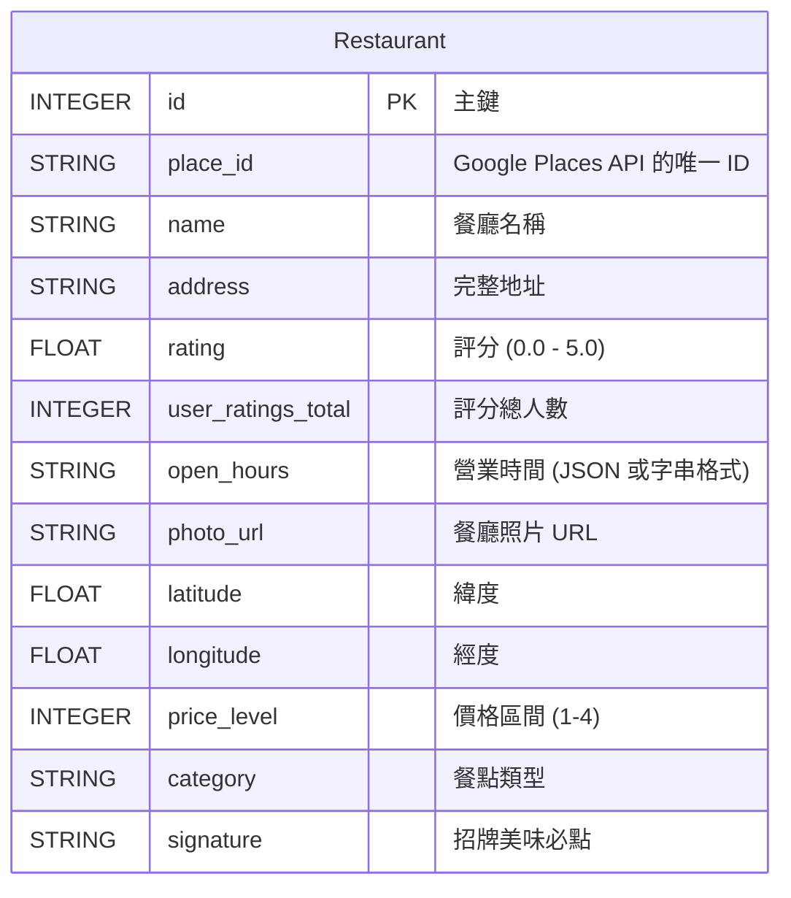
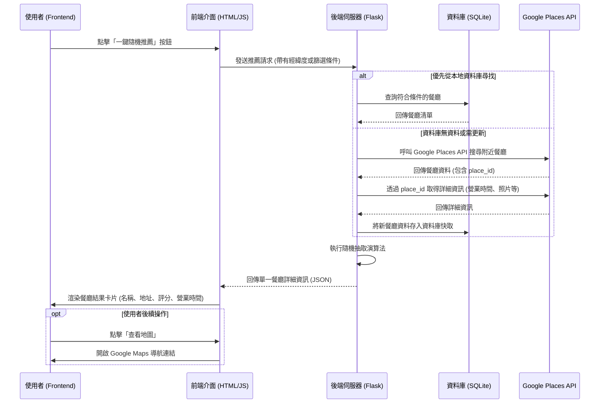

# 餐廳資訊顯示 - 架構與介面設計

這份文件針對「餐廳資訊顯示」功能（負責顯示餐廳名稱、地址、評分、營業時間等資訊）進行了資料庫結構與 UI/UX 流程的規劃。

## 1. 資料庫結構規劃 (Database Schema)

因為這項功能主要負責「呈現餐廳資訊」，我們需要一個 `Restaurant` 資料表來儲存這些欄位。如果後續串接 Google Places API，我們也可以將取得的結果快取到這個資料表中以提升效能並減少 API 呼叫次數。

## 2. 系統架構與 UI/UX 流程 (Architecture & Flow)

當使用者點擊「隨機推薦」後，系統的處理流程與 UI 互動如下：

## 3. 介面設計 (UI/UX Mockup)

請參考系統生成的 Mockup 預覽圖。介面設計重點如下：
- **視覺焦點**：頂部為大面積的餐廳美食照片，吸引食慾。
- **資訊層級**：以粗大字體顯示「餐廳名稱」，緊接著是「評分（星號）」、「營業時間」與「地址」。
- **行動呼籲 (CTA)**：
  - 主要按鈕（Primary Button）：**「導航去吃」**(Get Directions)，使用亮色系，點擊後開啟地圖。
  - 次要按鈕（Secondary Button）：**「再抽一次」**(Draw Again)，讓使用者快速重新選擇。
- **風格設計**：採用 RWD 與 Glassmorphism（毛玻璃）風格，圓角卡片設計，確保手機與桌面版都有良好的閱讀體驗。

